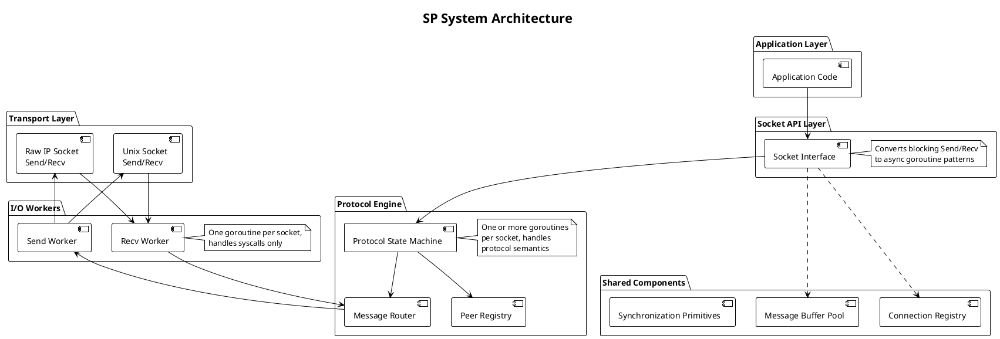
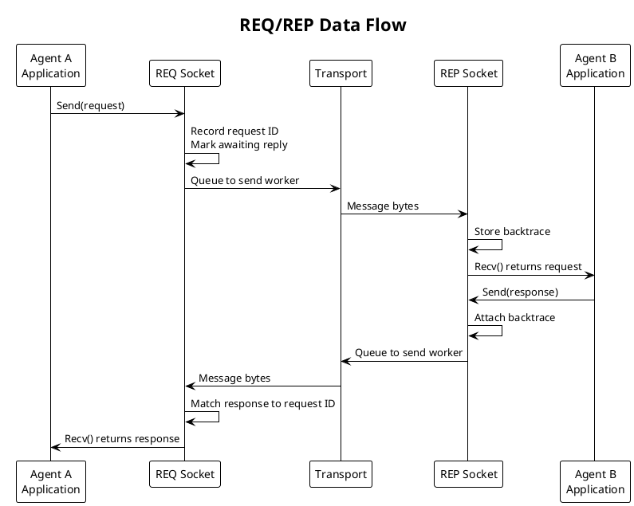
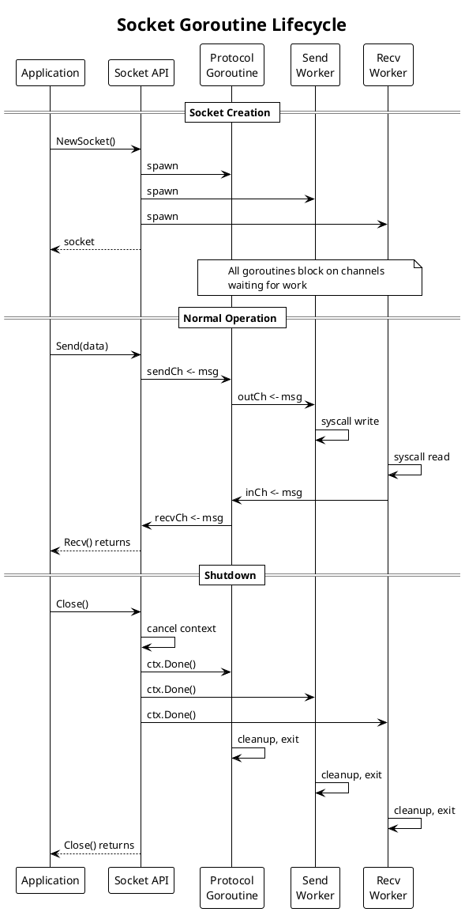
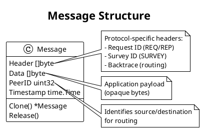

# SP Architecture: Scalability Protocols Implementation

## High-Level Overview

We implement the Scalability Protocols specification in pure Go with a layered, transport-agnostic architecture. We cleanly separate I/O concerns from protocol logic through goroutine-based workers and channel-based message passing.



## Component Responsibilities

### Application Layer

The application layer contains user code that initiates messaging operations. Applications call Send() and Recv() operations, handle results and errors, and perform application-level message framing if needed.

### Socket API Layer

The socket API layer provides a synchronous facade over asynchronous goroutine infrastructure. We provide blocking Send(message) and Recv() operations that convert sync calls into async goroutine-based patterns using channels. We manage socket lifecycle (Open, Close, Listen, Dial) and propagate errors from I/O and protocol layers.

### Protocol Engine

The protocol engine implements the semantics of specific Scalability Protocol patterns.

Table: Protocol Engine Responsibilities

| Pattern | Responsibilities |
|---------|------------------|
| REQ/REP | Request tracking, reply routing, timeout handling |
| PUB/SUB | Subscriber registration, message broadcasting, subscription tracking |
| PIPELINE | Work distribution, load balancing across workers |
| SURVEY | Survey initiation, response collection, timeout |
| BUS | Peer discovery, message routing, fair distribution |
| PAIR | Point-to-point connection management, buffering |

One or more protocol goroutines manage state machines and handle messages from the I/O layer.

### Message Router and Handoff

The message router uses channels to connect the protocol layer to I/O workers. We receive messages from I/O workers and route them to protocol logic, send processed outbound messages from protocol layer to I/O workers, preserve message boundaries across handoff, and buffer messages if needed to prevent stalling.

### Shared Infrastructure

Table: Shared Infrastructure Components

| Component | Purpose |
|-----------|---------|
| Message Buffer Pool | Preallocated buffers for message payloads, reducing allocation pressure |
| Peer Registry | Tracks connected peers, their protocol state, and subscription information |
| Connection Registry | Maps file descriptors or connection identifiers to socket state |
| Synchronization Primitives | Mutexes and RWMutex for protecting shared state |

### I/O Workers

I/O workers handle raw syscalls for sending and receiving bytes. One recv worker per socket reads packets and delivers them to the protocol layer. One send worker per socket batches outbound messages and flushes via syscall. Workers have no protocol understanding and handle transport failures (EAGAIN, connection drops). Both unixgram and raw IP preserve message boundaries.

### Transport Layer

Table: Transport Options

| Transport | Message Boundaries | Performance | Use Case |
|-----------|-------------------|-------------|----------|
| Unix Domain Sockets (unixgram) | Built-in via UDP-like semantics | Shared memory speed | Local coordination (AEON agents on same host) |
| Raw IP Sockets | Built-in via IP fragmentation | Direct IP routing, no TCP overhead | Distributed networks (agents across machines) |

## Data Flow Example: REQ/REP Pattern

Consider this scenario where Agent A asks Agent B for status and waits for a reply.



## Goroutine Lifecycle

We manage goroutines carefully to prevent leaks and ensure clean shutdown. Each socket spawns a fixed set of goroutines that live for the socket's lifetime.



Table: Goroutine Responsibilities

| Goroutine | Count per Socket | Responsibility |
|-----------|------------------|----------------|
| Protocol | 1-2 | State machine, message routing, peer tracking |
| Send Worker | 1 | Batching, syscall write, error handling |
| Recv Worker | 1 | Syscall read, framing, delivery to protocol |

## Error Handling

We propagate errors through the layer stack and provide clear error types for each failure mode.

Table: Error Categories

| Category | Examples | Handling |
|----------|----------|----------|
| Transport errors | Connection refused, timeout, EAGAIN | Retry or propagate to application |
| Protocol errors | Invalid state, missing peer, timeout | Return specific error to application |
| Resource errors | Buffer exhaustion, too many peers | Reject operation with clear error |
| Shutdown errors | Context canceled, socket closed | Return ErrClosed consistently |

We use Go's error wrapping to preserve context through the stack.

```go
// Error types for protocol operations
var (
    ErrClosed       = errors.New("socket closed")
    ErrTimeout      = errors.New("operation timed out")
    ErrInvalidState = errors.New("invalid protocol state")
    ErrNoPeer       = errors.New("no peer connected")
    ErrBufferFull   = errors.New("buffer full")
)

// Wrapping preserves context
return fmt.Errorf("send failed: %w", ErrTimeout)
```

## Message Format

We use a simple message structure that carries data and metadata through the system.



Table: Header Formats by Protocol

| Protocol | Header Content | Size |
|----------|---------------|------|
| REQ/REP | Request ID (MSB set) + optional peer IDs | 4+ bytes |
| SURVEY | Survey ID (MSB set) + optional peer IDs | 4+ bytes |
| PUB/SUB | None (topic is part of data) | 0 bytes |
| PIPELINE | None | 0 bytes |
| BUS | None | 0 bytes |
| PAIR | None | 0 bytes |

## Design Decisions

We made six architectural decisions that shape SP.

### 1. Transport Abstraction

We provide a single Socket interface with pluggable transport backends (Unix socket vs. Raw IP). This allows the same protocol implementation to work locally (speed) or distributed (scale) without code duplication. The agent developer chooses transport at socket creation time. We rejected separate implementations per transport because that leads to protocol duplication and higher maintenance burden.

### 2. Goroutine-Per-Socket I/O Model

We allocate one recv goroutine and one send goroutine per socket rather than using a thread pool or reactor pattern. Goroutines are lightweight and channels provide natural message passing. Each socket's I/O is isolated, making the system simple to reason about. We can scale to thousands of sockets without kernel thread exhaustion. We rejected the reactor/epoll-based model because it adds complexity without performance gain on modern Go schedulers and makes blocking behavior harder to debug.

### 3. Protocol Goroutines Per Socket

We run one or more goroutines for the protocol engine per socket, separate from I/O. The I/O layer never blocks on protocol logic, preventing recv stalls if protocol is slow. Protocol logic never touches syscalls, making testing easier with no wakeup complexity. Channels enforce clean handoff. We rejected the single goroutine per socket doing both I/O and protocol because it mixes concerns, makes testing harder, and creates artificial coupling.

### 4. Synchronous Blocking API First

We start with traditional Send() and Recv() blocking semantics before adding async API. This approach is simpler to reason about for correctness. Traditional message patterns (request/response) map naturally to blocking calls. Debugging is easier without callback complexity or goroutine lifetime mysteries. Phase 2 adds async API via channels and contexts for applications that need non-blocking integration.

### 5. Channel-Based Handoff

We use channels for message handoff between protocol and I/O layers rather than shared queues with locks. Channels are Go-native, provide backpressure naturally, and prevent races. Protocol and I/O layers stay independent and can be tested in isolation. We rejected shared queue plus mutex because it is more error-prone, requires explicit synchronization, and violates Go idioms.

### 6. Message Boundaries as First-Class

We ensure that both Unix sockets and Raw IP preserve message boundaries. We never fragment or reassemble at the library level. This simplifies protocol logic by eliminating the need for framing headers or reassembly windows. It limits maximum message size but aligns with typical agent coordination messages (control signals, not bulk data).

## Technology Choices

Table: Technology Stack

| Component | Technology | Rationale |
|-----------|------------|-----------|
| Language | Pure Go | Native goroutines, channels, context support; no C bindings simplifies deployment |
| I/O | Unix sockets (unixgram) | Datagram semantics, message boundaries, local IPC performance |
| Networking | Raw IP (IPPROTO_RAW or IPPROTO_UDP) | Minimal overhead, direct routing, no TCP state machine |
| Concurrency | Goroutines and Channels | Go-native, lightweight, natural message passing |
| Synchronization | sync.Mutex, sync.RWMutex | Standard library, well-understood, sufficient for registries and pools |
| Testing | Go testing package | Concurrent goroutines testable via race detector and context package |
| Cancellation | context.Context | Idiomatic Go for timeouts, cancellation, deadlines |

## Project Structure

```
sp/
├── README.md                    # Project overview
├── doc/
│   ├── VISION.md               # Project goals and non-goals
│   ├── ARCHITECTURE.md         # System design (this file)
│   ├── prd/                    # Product Requirements Documents
│   │   ├── protocols/          # Protocol pattern specifications
│   │   │   ├── req-rep-protocol.md
│   │   │   ├── pub-sub-protocol.md
│   │   │   ├── pipeline-protocol.md
│   │   │   ├── survey-protocol.md
│   │   │   ├── bus-protocol.md
│   │   │   └── pair-protocol.md
│   │   ├── infrastructure/     # Core infrastructure specs
│   │   │   ├── transport-abstraction.md
│   │   │   ├── shared-infrastructure.md
│   │   │   ├── io-workers.md
│   │   │   └── socket-api.md
│   │   └── api/                # API and testing specs
│   │       ├── async-api.md
│   │       └── testing-strategy.md
│   └── BACKGROUND/
│       └── nng/                # Scalability Protocol reference docs
│
├── cmd/                         # CLI tools (if any)
│
├── internal/
│   ├── transport/              # Transport abstraction
│   │   ├── unix.go             # Unix domain socket implementation
│   │   ├── raw_ip.go           # Raw IP socket implementation
│   │   └── interface.go        # Transport interface
│   │
│   ├── protocol/               # Protocol engines
│   │   ├── req_rep.go          # REQ/REP pattern
│   │   ├── pub_sub.go          # PUB/SUB pattern
│   │   ├── pipeline.go         # PIPELINE pattern
│   │   ├── survey.go           # SURVEY pattern
│   │   ├── bus.go              # BUS pattern
│   │   ├── pair.go             # PAIR pattern
│   │   └── base.go             # Common protocol logic
│   │
│   ├── io/                     # I/O workers
│   │   ├── receiver.go         # Recv worker implementation
│   │   ├── sender.go           # Send worker implementation
│   │   └── worker.go           # Worker base and lifecycle
│   │
│   └── pool/                   # Shared infrastructure
│       ├── buffer.go           # Message buffer pool
│       ├── peer.go             # Peer registry
│       └── connection.go       # Connection registry
│
├── socket.go                    # Socket API facade
├── error.go                     # Error types
│
└── test/
    ├── transport_test.go       # Transport layer tests
    ├── protocol_test.go        # Protocol engine tests
    ├── integration_test.go     # End-to-end tests
    └── bench_test.go           # Performance benchmarks
```

## Implementation Phases

Table: Implementation Roadmap

| Phase | Focus | Deliverables |
|-------|-------|--------------|
| Phase 1 | Foundation (Synchronous API) | Transport abstraction, REQ/REP pattern, error handling, unit tests, integration test |
| Phase 2 | Additional Patterns | PUB/SUB, PIPELINE, SURVEY, BUS, PAIR patterns with correctness testing |
| Phase 3 | Async API and Polish | Channel-based Send/Recv, context integration, benchmarks, stress testing, documentation |
| Phase 4 | AEON Integration | Integration with AEON agent coordinator, load testing, performance tuning |
