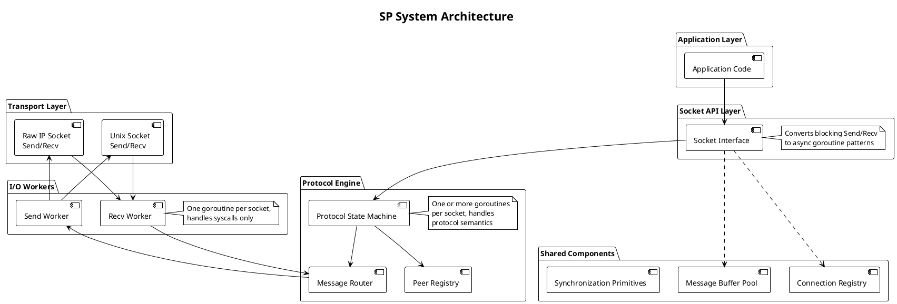

# SP Architecture: Scalability Protocols Implementation

## High-Level Overview

SP implements the Scalability Protocols specification in pure Go with a layered, transport-agnostic architecture. The system cleanly separates I/O concerns from protocol logic through goroutine-based workers and channel-based message passing.



## Component Responsibilities

### Application Layer
**What it does**: User code that initiates messaging operations.

**Responsibilities**:
- Calls Send() and Recv() operations
- Handles results and errors from messaging operations
- Application-level message framing if needed

### Socket API Layer
**What it does**: Synchronous facade over asynchronous goroutine infrastructure.

**Responsibilities**:
- Provides blocking Send(message) and Recv() → message operations
- Converts sync calls into async goroutine-based patterns using channels
- Manages socket lifecycle (Open, Close, Listen, Dial)
- Error propagation from I/O and protocol layers

### Protocol Engine
**What it does**: Implements the semantics of specific Scalability Protocol patterns.

**Responsibilities** (varies by pattern):
- REQ/REP: Request tracking, reply routing, timeout handling
- PUB/SUB: Subscriber registration, message broadcasting, subscription tracking
- PIPELINE: Work distribution, load balancing across workers
- SURVEY: Survey initiation, response collection, timeout
- BUS: Peer discovery, message routing, fair distribution
- PAIR: Point-to-point connection management, buffering

**Per-pattern goroutines**: One or more protocol goroutines manage state machines and handle messages from the I/O layer.

### Message Router & Handoff
**What it does**: Channels that connect protocol layer to I/O workers.

**Responsibilities**:
- Receive messages from I/O workers and route to protocol logic
- Send processed/outbound messages from protocol layer to I/O workers
- Preserve message boundaries across handoff
- Buffer messages if needed to prevent stalling

### Shared Infrastructure
**Message Buffer Pool**: Preallocated buffers for message payloads, reducing allocation pressure during high-throughput messaging.

**Peer Registry**: Tracks connected peers, their protocol state, and subscription information.

**Connection Registry**: Maps file descriptors or connection identifiers to socket state.

**Synchronization Primitives**: Mutexes and RWMutex for protecting shared state (registries, pools, peer lists).

### I/O Workers
**What it does**: Raw syscall handlers for sending and receiving bytes.

**Responsibilities**:
- One recv worker per socket: reads packets/messages, frames them, delivers to protocol layer
- One send worker per socket: batches outbound messages, flushes via syscall
- No protocol understanding—purely mechanical I/O
- Error handling for transport failures (EAGAIN, connection drops)
- Preserves message boundaries at transport level (unixgram and raw IP both provide framing)

### Transport Layer
**Unix Domain Sockets (`unixgram`)**: Datagram-oriented IPC for local host-only communication.
- Message boundaries: Built-in by UDP-like semantics
- Performance: Shared memory speed, minimal overhead
- Use case: Tight local coordination (AEON agents on same host)

**Raw IP Sockets**: Datagram sockets at IP layer (no TCP).
- Message boundaries: Built-in by IP fragmentation handling
- Performance: Direct IP routing, no TCP overhead
- Use case: Distributed agent networks (agents across machines)

## Data Flow Example: REQ/REP Pattern

**Scenario**: Agent A wants to ask Agent B for status, wait for reply.

1. **Application initiates**: `client.Send(request)` blocks
2. **Socket API**: Queues send operation to protocol goroutine
3. **Protocol Engine (REQ side)**: 
   - Records request ID
   - Marks request as "awaiting reply"
   - Queues to send worker
4. **Send Worker**: Writes message bytes via `unixgram.SendTo()`
5. **Peer I/O (Agent B, REC side)**:
   - Recv worker reads bytes
   - Delivers to protocol engine
6. **Protocol Engine (REP side)**:
   - Routes to application waiting in `Recv()`
7. **Application (Agent B)**: Processes request, calls `server.Send(response)`
8. **Protocol Engine (REP side)**: Captures source address, queues response to send worker
9. **Send Worker**: Routes back to Agent A
10. **Protocol Engine (REQ side)**: Matches response to request ID
11. **Socket API (Client)**: Unblocks `Send()`, unblocks waiting `Recv()`
12. **Application (Agent A)**: Has response

## Key Design Decisions

### 1. Transport Abstraction
**Decision**: Single Socket interface with pluggable transport backends (Unix socket vs. Raw IP).

**Why**: Allows same protocol implementation to work locally (speed) or distributed (scale) without code duplication. Agent developer chooses transport at socket creation time.

**Alternative rejected**: Separate implementations per transport—leads to protocol duplication and higher maintenance burden.

### 2. Goroutine-Per-Socket I/O Model
**Decision**: One recv + one send goroutine per socket, not a thread pool or reactor pattern.

**Why**: Goroutines are lightweight; channels provide natural message passing. Simple to reason about: each socket's I/O is isolated. Scales to thousands of sockets without kernel thread exhaustion.

**Alternative rejected**: Reactor/epoll-based model—more complex, no performance gain on modern Go schedulers, harder to debug blocking behavior.

### 3. Protocol Goroutine(s) Per Socket
**Decision**: Protocol engine runs one or more goroutines per socket, separate from I/O.

**Why**: I/O layer never blocks on protocol logic (prevents recv stalls if protocol is slow). Protocol logic never touches syscalls (easier testing, no wakeup complexity). Channels enforce clean handoff.

**Alternative rejected**: Single goroutine per socket doing I/O and protocol—mixes concerns, makes testing harder, creates artificial coupling.

### 4. Synchronous Blocking API First
**Decision**: Start with traditional `Send()` / `Recv()` blocking semantics before adding async API.

**Why**: Simpler to reason about correctness. Traditional message patterns (request/response) map naturally to blocking calls. Easier to debug (no callback hell or goroutine lifetime mysteries).

**Phase 2 adds**: Async API via channels/contexts, for applications that need non-blocking integration.

### 5. Channel-Based Handoff, Not Shared Memory
**Decision**: Message handoff between protocol and I/O layers via channels, not shared queues with locks.

**Why**: Channels are Go-native, provide backpressure naturally, prevent races. Protocol and I/O layers stay independent—can be tested in isolation.

**Alternative rejected**: Shared queue + mutex—more error-prone, requires explicit synchronization, Go idiom is channels.

### 6. Message Boundaries as First-Class
**Decision**: Both Unix sockets and Raw IP preserve message boundaries; never fragment or reassemble at the library level.

**Why**: Simplifies protocol logic—no need for framing headers or reassembly windows. Limits maximum message size but aligns with typical agent coordination messages (control signals, not bulk data).

## Technology Choices

| Component | Technology | Rationale |
|-----------|-----------|-----------|
| **Language** | Pure Go | Native goroutines, channels, context support. No C bindings = simpler deployment. |
| **I/O** | Unix sockets (`unixgram`) | Datagram semantics, message boundaries, local IPC performance. |
| **Networking** | Raw IP (IPPROTO_RAW or IPPROTO_UDP) | Minimal overhead, direct routing, no TCP state machine. |
| **Concurrency** | Goroutines + Channels | Go-native, lightweight, natural message passing. |
| **Synchronization** | sync.Mutex, sync.RWMutex | Standard library, well-understood, sufficient for peer registries and pools. |
| **Testing** | Go's `testing` package | Concurrent goroutines testable via race detector and `context` package. |
| **Context & Cancellation** | context.Context | Idiomatic Go for timeouts, cancellation, deadlines. |

## Project Structure

```
sp/
├── README.md                    # Project overview
├── doc/
│   ├── VISION.md               # This file (strategic intent)
│   ├── ARCHITECTURE.md         # This file (system design)
│   └── BACKGROUND/
│       └── nng/                # Scalability Protocol reference docs
│
├── cmd/                         # CLI tools (if any)
│
├── internal/
│   ├── transport/              # Transport abstraction
│   │   ├── unix.go             # Unix domain socket implementation
│   │   ├── raw_ip.go           # Raw IP socket implementation
│   │   └── interface.go        # Transport interface
│   │
│   ├── protocol/               # Protocol engines
│   │   ├── req_rep.go          # REQ/REP pattern
│   │   ├── pub_sub.go          # PUB/SUB pattern
│   │   ├── pipeline.go         # PIPELINE pattern
│   │   ├── survey.go           # SURVEY pattern
│   │   ├── bus.go              # BUS pattern
│   │   ├── pair.go             # PAIR pattern
│   │   └── base.go             # Common protocol logic
│   │
│   ├── io/                     # I/O workers
│   │   ├── receiver.go         # Recv worker implementation
│   │   ├── sender.go           # Send worker implementation
│   │   └── worker.go           # Worker base/lifecycle
│   │
│   └── pool/                   # Shared infrastructure
│       ├── buffer.go           # Message buffer pool
│       ├── peer.go             # Peer registry
│       └── connection.go       # Connection registry
│
├── socket.go                    # Socket API facade
├── error.go                     # Error types
│
└── test/
    ├── transport_test.go       # Transport layer tests
    ├── protocol_test.go        # Protocol engine tests
    ├── integration_test.go      # End-to-end tests
    └── bench_test.go           # Performance benchmarks
```

## What's Next

### Phase 1: Foundation (Synchronous API)
1. Implement transport abstraction (Unix + Raw IP backends)
2. Implement REQ/REP pattern with blocking API
3. Basic error handling and resource cleanup
4. Unit tests for transport and protocol layer
5. Integration test: local agent request/response

### Phase 2: Additional Patterns
1. Implement PUB/SUB pattern
2. Implement PIPELINE pattern
3. Implement SURVEY, BUS, PAIR patterns
4. Correctness testing across all patterns

### Phase 3: Async API & Polish
1. Channel-based Send/Recv wrapper
2. Context integration (timeouts, cancellation)
3. Performance benchmarks vs. TCP
4. Stress testing (goroutine leaks, race detector)
5. Documentation and examples

### Phase 4: AEON Integration
1. Integration with AEON agent coordinator
2. Load testing under real agent workloads
3. Performance tuning based on observed patterns
