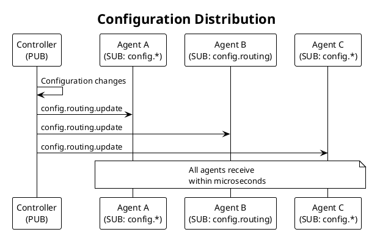
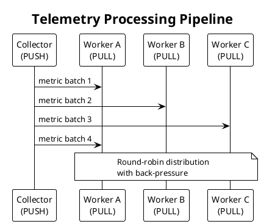
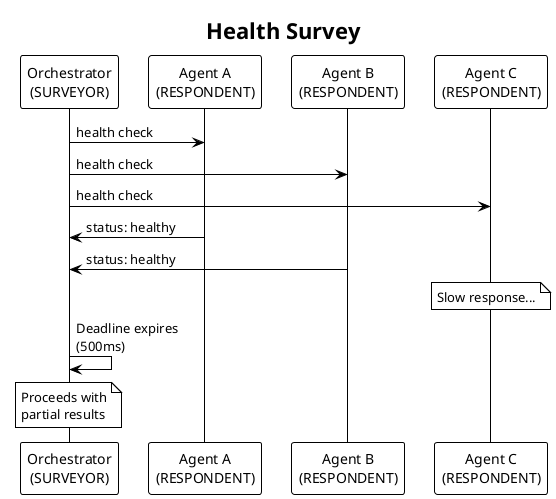

# SP Vision: Scalability Protocols for Go

## The Problem

Agent coordination systems in network management require a high-performance messaging substrate. We need to address four challenges.

Table: Messaging Substrate Challenges

| Challenge | Description |
|-----------|-------------|
| Transport flexibility | Switch between local IPC (shared memory speeds) and distributed network communication |
| Low latency | Minimize overhead from protocol complexity and transport mechanisms |
| Separation of concerns | Isolate transport concerns from protocol logic across messaging patterns |
| Go-native design | Leverage goroutines and channels rather than callback models |

Existing solutions couple transport and protocol tightly, impose overhead for local communication, or provide non-idiomatic APIs for Go environments.

## What We Provide

SP is a pure Go implementation of the Scalability Protocols specification. We act as a high-performance messaging substrate with the following capabilities.

Table: SP Capabilities

| Capability | Description |
|------------|-------------|
| Transport abstraction | Same API for Unix domain sockets (local IPC) or raw IP sockets (inter-host) |
| Wire-protocol compatibility | Interoperates with other Scalability Protocol implementations |
| Multiple messaging patterns | REQ/REP, PUB/SUB, PIPELINE, SURVEY, BUS, and PAIR patterns |
| Layered architecture | I/O workers handle syscalls, protocol engines handle semantics |
| Go-native API | Goroutines, channels, and contexts instead of callbacks |

## Specification and Compatibility

SP implements the Scalability Protocols specification, a family of messaging patterns originally defined by the nanomsg project and continued by NNG (nanomsg next generation). We maintain wire-protocol compatibility with these implementations while providing a Go-native API.

### Protocol Lineage

The Scalability Protocols emerged from Martin Sústrik's work on ZeroMQ and nanomsg. NNG, created by Garrett D'Amore, modernized the implementation while preserving wire compatibility. SP continues this lineage as a pure Go implementation.

Table: Protocol History

| Project | Language | Status | Relationship to SP |
|---------|----------|--------|-------------------|
| nanomsg | C | Deprecated | Original specification source |
| NNG | C | Active | Wire-protocol compatible; reference implementation |
| mangos | Go | Active | Alternative Go implementation; SP is independent |
| SP | Go | Development | Wire-protocol compatible; unique transport layer |

### Supported Protocols

We implement six Scalability Protocol patterns.

Table: Implemented Protocols

| Protocol | Pattern | Description |
|----------|---------|-------------|
| REQ/REP | Request-Reply | Synchronous request with correlated response |
| PUB/SUB | Publish-Subscribe | One-to-many broadcast with topic filtering |
| PUSH/PULL | Pipeline | Work distribution with round-robin load balancing |
| SURVEYOR/RESPONDENT | Survey | Broadcast query with deadline-based response collection |
| BUS | Bus | Many-to-many peer mesh communication |
| PAIR | Pair | Exclusive bidirectional point-to-point channel |

### Wire-Protocol Compatibility

We guarantee wire-protocol compatibility with NNG for all supported patterns. SP can exchange messages with NNG peers over compatible transports. We achieve this by implementing the same message framing, header formats, and protocol state machines.

Table: Compatibility Guarantees

| Aspect | Guarantee |
|--------|-----------|
| Message format | Binary-compatible with NNG message framing |
| Protocol headers | Request IDs, backtraces, and survey IDs match NNG format |
| State machines | Protocol state transitions follow NNG behavior |
| API compatibility | Not guaranteed; SP uses Go-idiomatic interfaces |

### Transport Differences

While we maintain protocol compatibility, SP uses different transports optimized for our use cases.

Table: Transport Comparison

| Transport | NNG | SP | Notes |
|-----------|-----|-----|-------|
| inproc | Yes | No | We use goroutines and channels instead |
| IPC | Yes (stream) | Yes (datagram) | SP uses unixgram for message boundaries |
| TCP | Yes | No | We use raw IP to avoid TCP overhead |
| Raw IP | No | Yes | SP-specific for low-latency networking |

Cross-implementation communication requires compatible transports. SP peers can communicate with NNG peers over IPC (using stream mode) or via protocol bridges.

## Use Cases

We design SP for agent coordination in network management. The following examples illustrate how different protocol patterns address real coordination challenges.

### Use Case 1: Configuration Distribution (PUB/SUB)

A network controller manages dozens of agents on the same host. When configuration changes, all agents must receive the update simultaneously.

Table: Configuration Distribution

| Aspect | Description |
|--------|-------------|
| Problem | Traditional HTTP polling creates unnecessary load and latency; agents check for updates that rarely exist |
| SP Solution | Controller uses PUB socket to broadcast configuration updates; agents use SUB sockets with topic filtering |
| Transport | Unix domain sockets for local IPC at shared-memory speeds |
| Benefit | Zero polling overhead; agents receive updates within microseconds of publication |

### Use Case 2: Task Distribution (PIPELINE)

A telemetry collector generates thousands of metrics per second. Multiple worker agents must process these metrics without any single worker becoming a bottleneck.

Table: Task Distribution

| Aspect | Description |
|--------|-------------|
| Problem | Single-threaded processing cannot keep pace; distributing work manually requires complex load balancing |
| SP Solution | Collector uses PUSH socket; workers use PULL sockets; SP handles round-robin distribution automatically |
| Transport | Unix sockets for local workers; raw IP for distributed workers |
| Benefit | Linear scaling with worker count; back-pressure prevents memory exhaustion |

### Use Case 3: Health Monitoring (SURVEY)

An orchestrator needs to check the health of all agents and collect their status within a strict deadline. Some agents may be slow or unresponsive.

Table: Health Monitoring

| Aspect | Description |
|--------|-------------|
| Problem | Sequential health checks take too long; parallel HTTP calls require complex timeout handling |
| SP Solution | Orchestrator uses SURVEYOR socket with 500ms deadline; agents use RESPONDENT sockets |
| Transport | Raw IP for agents across multiple hosts |
| Benefit | Single broadcast, parallel responses, automatic deadline enforcement |

### Use Case 4: Agent Pairing (PAIR)

Two agents need an exclusive bidirectional channel for real-time coordination. Either agent may initiate communication at any time.

Table: Agent Pairing

| Aspect | Description |
|--------|-------------|
| Problem | TCP connections require explicit protocol design for bidirectional messaging; WebSockets add overhead |
| SP Solution | Both agents use PAIR sockets for exclusive full-duplex communication |
| Transport | Unix socket for same-host; raw IP for cross-host |
| Benefit | Simple symmetric API; no protocol design needed; exclusive connection prevents interference |

## Success Criteria

We measure success across five dimensions.

Table: Success Criteria

| Dimension | Target |
|-----------|--------|
| Performance | Local Unix socket communication matches shared-memory speeds; raw IP reduces overhead compared to TCP |
| Correctness | Wire-protocol compatibility verified; all SP patterns implement state machines correctly |
| Usability | Synchronous blocking API works reliably; asynchronous API integrates with channels and select |
| Reliability | Clear separation of concerns makes goroutine leaks, deadlocks, and race conditions detectable |
| Adoption | AEON agent coordination systems use SP for local orchestration and distributed networks |

## What We Are Not

We have explicit non-goals to maintain focus.

Table: Non-Goals

| Non-Goal | Rationale |
|----------|-----------|
| Drop-in NNG replacement | We are wire-protocol compatible, not API-compatible with NNG |
| General-purpose RPC | We focus on patterns and reliability, not serialization or service discovery |
| Queue broker | Messages do not persist; we provide synchronous coordination |
| gRPC or HTTP replacement | Those tools excel for service-to-service; we optimize for agent-to-agent messaging |
| Async-first design | We start with synchronous semantics, then add Go-idiomatic async |
