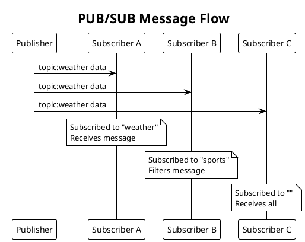
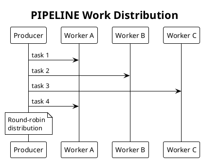
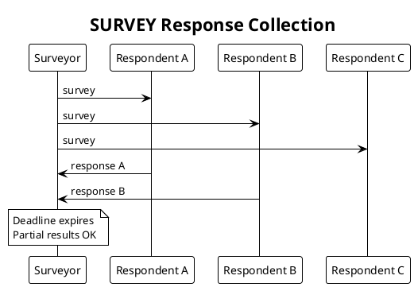

# PRD: Additional Protocol Patterns (Phase 2)

Issue: sp-ms6.8
Status: Draft
Author: Claude
Date: 2026-01-27

## Overview

We specify the remaining Scalability Protocol patterns beyond REQ/REP: PUB/SUB for broadcast messaging, PIPELINE for work distribution, SURVEY for request-response fanout, BUS for peer-to-peer communication, and PAIR for bidirectional channels. These patterns build on the foundation established by the REQ/REP implementation.

## Common Design Elements

All protocols share these elements from the REQ/REP foundation:

Table: Shared Components

| Component | Usage |
|-----------|-------|
| State Machine Pattern | Each socket type has well-defined states |
| Protocol Goroutine | Dedicated goroutine(s) manage protocol logic |
| I/O Worker Integration | SendCh/RecvCh channels connect to WorkerPair |
| Shared Infrastructure | BufferPool, PeerRegistry, ConnRegistry |
| Error Types | Consistent error handling (ErrClosed, ErrTimeout) |

## PUB/SUB Pattern

### Overview

PUB/SUB provides one-to-many message distribution. A PUB (publisher) socket broadcasts messages to all connected SUB (subscriber) sockets. Subscribers can filter messages by topic prefix.



Table: PUB/SUB Requirements

| ID | Requirement |
|----|-------------|
| PS-1 | PUB socket broadcasts messages to all connected subscribers |
| PS-2 | SUB socket receives messages matching subscribed topics |
| PS-3 | Topic matching uses prefix-based filtering |
| PS-4 | Subscribers can subscribe/unsubscribe to multiple topics |
| PS-5 | Empty subscription matches all messages |
| PS-6 | No reply expected (fire and forget semantics) |

### Design

We implement PUB as a stateless broadcaster and SUB with topic filtering:

```go
// PubSocket broadcasts messages to all subscribers.
type PubSocket struct {
    base   *BaseSocket
    peers  *PeerRegistry
    sendCh chan<- *Message
}

// Send broadcasts a message to all connected subscribers.
func (s *PubSocket) Send(data []byte) error

// SubSocket receives messages from publishers.
type SubSocket struct {
    base    *BaseSocket
    subsMu  sync.RWMutex
    subs    map[string]struct{}  // Topic prefixes
    recvCh  <-chan *Message
}

// Subscribe adds a topic prefix subscription.
func (s *SubSocket) Subscribe(topic string) error

// Unsubscribe removes a topic subscription.
func (s *SubSocket) Unsubscribe(topic string) error

// Recv receives the next message matching subscriptions.
func (s *SubSocket) Recv() ([]byte, error)
```

## PIPELINE Pattern

### Overview

PIPELINE distributes work among multiple workers. PUSH sockets send tasks, PULL sockets receive them. We load-balance tasks across available workers.



Table: PIPELINE Requirements

| ID | Requirement |
|----|-------------|
| PL-1 | PUSH socket sends messages to one connected PULL socket |
| PL-2 | PULL socket receives messages from connected PUSH sockets |
| PL-3 | Messages are load-balanced across PULL sockets (round-robin) |
| PL-4 | No reply expected (one-way data flow) |
| PL-5 | Backpressure when all workers busy |

### Design

```go
// PushSocket sends tasks to workers.
type PushSocket struct {
    base    *BaseSocket
    peers   *PeerRegistry
    peerIdx atomic.Uint32  // Round-robin index
}

// Send sends a task to one worker (round-robin selection).
func (s *PushSocket) Send(data []byte) error

// PullSocket receives tasks from producers.
type PullSocket struct {
    base   *BaseSocket
    recvCh <-chan *Message
}

// Recv receives the next task.
func (s *PullSocket) Recv() ([]byte, error)
```

## SURVEY Pattern

### Overview

SURVEY implements request-response fanout. A SURVEYOR socket sends a query to all RESPONDENT sockets and collects responses within a deadline.



Table: SURVEY Requirements

| ID | Requirement |
|----|-------------|
| SV-1 | SURVEYOR sends survey to all connected respondents |
| SV-2 | RESPONDENT receives surveys and sends responses |
| SV-3 | SURVEYOR collects responses within a deadline |
| SV-4 | Survey ID correlates responses to the originating survey |
| SV-5 | Partial results available when deadline expires |

### Design

```go
// SurveyorSocket sends surveys and collects responses.
type SurveyorSocket struct {
    base       *BaseSocket
    state      atomic.Uint32
    surveyID   atomic.Uint32
    pending    *pendingSurvey
    deadline   time.Duration
    peers      *PeerRegistry
}

// Send broadcasts a survey to all respondents.
func (s *SurveyorSocket) Send(data []byte) error

// Recv receives the next response to the active survey.
// Returns ErrTimeout when deadline expires.
func (s *SurveyorSocket) Recv() ([]byte, error)

// SetDeadline sets the survey collection deadline.
func (s *SurveyorSocket) SetDeadline(d time.Duration)

// RespondentSocket receives surveys and sends responses.
type RespondentSocket struct {
    base            *BaseSocket
    state           atomic.Uint32
    currentSurveyID uint32
    currentPeer     PeerID
}

// Recv receives the next survey.
func (s *RespondentSocket) Recv() ([]byte, error)

// Send sends a response to the current survey.
func (s *RespondentSocket) Send(data []byte) error
```

## BUS Pattern

### Overview

BUS provides many-to-many communication. Each BUS socket can send and receive. We deliver messages to all other connected BUS sockets.

Table: BUS Requirements

| ID | Requirement |
|----|-------------|
| BU-1 | BUS socket can send and receive messages |
| BU-2 | Sent messages delivered to all other connected BUS peers |
| BU-3 | Messages not echoed back to sender |
| BU-4 | No state machine (always ready to send/receive) |

### Design

```go
// BusSocket provides many-to-many communication.
type BusSocket struct {
    base   *BaseSocket
    peers  *PeerRegistry
    sendCh chan<- *Message
    recvCh <-chan *Message
}

// Send broadcasts a message to all connected peers.
func (s *BusSocket) Send(data []byte) error

// Recv receives a message from any connected peer.
func (s *BusSocket) Recv() ([]byte, error)
```

## PAIR Pattern

### Overview

PAIR provides exclusive bidirectional communication between exactly two endpoints. We allow only one peer connection.

Table: PAIR Requirements

| ID | Requirement |
|----|-------------|
| PA-1 | PAIR socket connects to exactly one peer |
| PA-2 | Both endpoints can send and receive |
| PA-3 | Additional connection attempts rejected |
| PA-4 | No state machine (always ready to send/receive) |

### Design

```go
// PairSocket provides exclusive bidirectional communication.
type PairSocket struct {
    base   *BaseSocket
    peerMu sync.Mutex
    peer   *Peer
    sendCh chan<- *Message
    recvCh <-chan *Message
}

// Connect establishes connection to peer.
// Returns error if already connected.
func (s *PairSocket) Connect(addr string) error

// Send sends a message to the connected peer.
func (s *PairSocket) Send(data []byte) error

// Recv receives a message from the connected peer.
func (s *PairSocket) Recv() ([]byte, error)
```

## Protocol Comparison

Table: Protocol Characteristics

| Pattern | Topology | Direction | State Machine | Distinguishing Feature |
|---------|----------|-----------|---------------|------------------------|
| REQ/REP | N:1 | Request-Reply | Yes | Correlation |
| PUB/SUB | 1:N | One-way | No | Topic filtering |
| PIPELINE | N:M | One-way | No | Load balancing |
| SURVEY | 1:N:1 | Query-Response | Yes | Deadline collection |
| BUS | N:N | Bidirectional | No | Peer mesh |
| PAIR | 1:1 | Bidirectional | No | Exclusive channel |

## Testing Strategy

Table: Pattern-Specific Tests

| Pattern | Tests |
|---------|-------|
| PUB/SUB | Fan-out, topic filtering, subscription management |
| PIPELINE | Load balancing, backpressure, worker failure |
| SURVEY | Response collection, deadline handling, partial results |
| BUS | Mesh connectivity, no echo, concurrent send/recv |
| PAIR | Exclusivity, bidirectional flow, reconnection |

## Acceptance Criteria

We consider this PRD complete when:

1. PUB/SUB implements broadcast with topic filtering
2. PIPELINE implements round-robin load balancing
3. SURVEY implements deadline-based response collection
4. BUS implements many-to-many mesh
5. PAIR implements exclusive bidirectional channel
6. All state machines are validated
7. Pattern-specific and integration tests pass
8. GoDoc exists for all types and methods

## Dependencies

We depend on REQ/REP Protocol Engine (sp-ms6.2), Shared Infrastructure (sp-ms6.7), and I/O Workers (sp-ms6.3).

## References

- [NNG PUB/SUB](https://nng.nanomsg.org/man/tip/nng_pub.7.html)
- [NNG PIPELINE](https://nng.nanomsg.org/man/tip/nng_push.7.html)
- [NNG SURVEY](https://nng.nanomsg.org/man/tip/nng_surveyor.7.html)
- [NNG BUS](https://nng.nanomsg.org/man/tip/nng_bus.7.html)
- [NNG PAIR](https://nng.nanomsg.org/man/tip/nng_pair.7.html)
