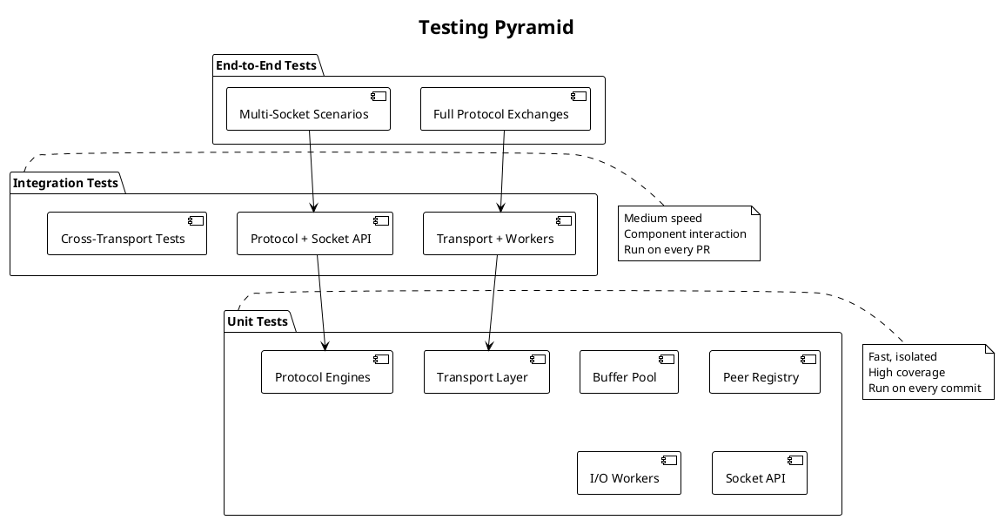

# PRD: Testing Strategy and Quality Assurance

Issue: sp-ms6.5
Status: Draft
Author: Claude
Date: 2026-01-27

## Overview

We define a comprehensive testing strategy for SP covering unit tests for individual components, integration tests for end-to-end flows, benchmarks for performance validation, and quality gates for continuous integration.



## Requirements

Table: Functional Requirements

| ID | Requirement |
|----|-------------|
| TS-1 | Unit tests cover all exported functions and types |
| TS-2 | Integration tests verify end-to-end message flows |
| TS-3 | Benchmarks measure latency and throughput |
| TS-4 | Race detector validates concurrency correctness |
| TS-5 | Tests cover error conditions and edge cases |
| TS-6 | No goroutine leaks in any test scenario |

Table: Non-Functional Requirements

| ID | Requirement |
|----|-------------|
| NF-1 | Unit tests run in under 30 seconds |
| NF-2 | Integration tests run in under 2 minutes |
| NF-3 | All tests pass with -race flag |
| NF-4 | Code coverage exceeds 80% for core packages |
| NF-5 | Benchmarks are reproducible (under 10% variance) |

## Test Organization

We organize tests alongside the code they test:

```
sp/
├── transport/
│   ├── unix.go
│   ├── unix_test.go
│   ├── ip.go
│   └── ip_test.go
├── internal/
│   ├── pool/
│   │   ├── buffer.go
│   │   └── buffer_test.go
│   ├── io/
│   │   ├── worker.go
│   │   └── worker_test.go
│   └── protocol/
│       ├── reqrep.go
│       └── reqrep_test.go
├── socket.go
├── socket_test.go
└── test/
    ├── integration_test.go
    ├── bench_test.go
    └── testutil/
        ├── transport.go
        └── helpers.go
```

Table: Test Naming Conventions

| Pattern | Description | Example |
|---------|-------------|---------|
| TestComponentScenario | Unit test | TestBufferPoolGet |
| TestIntegrationFlow | Integration test | TestIntegrationReqRep |
| BenchmarkOperation | Benchmark | BenchmarkSendRecvLatency |
| ExampleUsage | Runnable example | ExampleReqSocket |

## Unit Test Strategy

### Transport Layer Tests

We test both Unix and IP transports with the same test patterns:

```go
func TestUnixTransportSend(t *testing.T) {
    // Setup: create paired sockets
    // Action: send message
    // Assert: message received correctly
}

func TestUnixTransportMessageBoundary(t *testing.T) {
    // Setup: create paired sockets
    // Action: send multiple messages rapidly
    // Assert: each message received intact, no merging
}

func TestUnixTransportConcurrent(t *testing.T) {
    // Setup: create paired sockets
    // Action: concurrent sends from multiple goroutines
    // Assert: all messages received, no data corruption
}
```

### Shared Infrastructure Tests

We verify buffer pooling and registry operations:

```go
func TestBufferPoolGetPut(t *testing.T) {
    pool := NewBufferPool(64 * 1024)

    buf := pool.Get(1024)
    assert.True(t, len(buf) >= 1024)

    pool.Put(buf)
    // Get should return pooled buffer
    buf2 := pool.Get(1024)
    // May be same underlying array
}

func TestBufferPoolConcurrent(t *testing.T) {
    pool := NewBufferPool(64 * 1024)
    var wg sync.WaitGroup

    for i := 0; i < 100; i++ {
        wg.Add(1)
        go func() {
            defer wg.Done()
            for j := 0; j < 1000; j++ {
                buf := pool.Get(1024)
                pool.Put(buf)
            }
        }()
    }
    wg.Wait()
    // No panics, no races
}
```

### Protocol Engine Tests

We verify state machine transitions and message correlation:

```go
func TestReqStateMachine(t *testing.T) {
    tests := []struct {
        name      string
        initial   ReqState
        action    string
        wantState ReqState
        wantErr   error
    }{
        {"send from idle", ReqStateIdle, "send", ReqStateRequestSent, nil},
        {"recv from idle", ReqStateIdle, "recv", ReqStateIdle, ErrInvalidState},
        {"send while awaiting", ReqStateAwaitingReply, "send", ReqStateRequestSent, nil},
    }

    for _, tt := range tests {
        t.Run(tt.name, func(t *testing.T) {
            // Test state transitions
        })
    }
}
```

## Integration Test Strategy

### End-to-End Tests

We test complete message flows through all layers:

```go
func TestIntegrationReqRepUnix(t *testing.T) {
    if testing.Short() {
        t.Skip("skipping integration test")
    }

    addr := "unix:///tmp/sp-test-" + randomID() + ".sock"
    defer os.Remove(addr[7:])

    // Start replier
    rep, _ := NewRepSocket()
    rep.Listen(addr)
    defer rep.Close()

    go func() {
        for {
            data, err := rep.Recv()
            if err != nil {
                return
            }
            rep.Send(append([]byte("echo:"), data...))
        }
    }()

    // Start requester
    req, _ := NewReqSocket()
    req.Dial(addr)
    defer req.Close()

    time.Sleep(50 * time.Millisecond)

    // Exchange messages
    for i := 0; i < 100; i++ {
        msg := []byte(fmt.Sprintf("msg-%d", i))
        req.Send(msg)
        reply, _ := req.Recv()
        assert.Equal(t, append([]byte("echo:"), msg...), reply)
    }
}
```

### Goroutine Leak Detection

We verify no goroutines leak on socket close:

```go
func TestNoGoroutineLeaks(t *testing.T) {
    initialGoroutines := runtime.NumGoroutine()

    // Create and close many sockets
    for i := 0; i < 100; i++ {
        req, _ := NewReqSocket()
        rep, _ := NewRepSocket()

        addr := "unix:///tmp/sp-leak-" + randomID() + ".sock"
        rep.Listen(addr)
        req.Dial(addr)

        time.Sleep(10 * time.Millisecond)

        req.Close()
        rep.Close()
        os.Remove(addr[7:])
    }

    // Allow goroutines to exit
    time.Sleep(100 * time.Millisecond)
    runtime.GC()

    finalGoroutines := runtime.NumGoroutine()

    // Allow small variance for runtime goroutines
    assert.InDelta(t, initialGoroutines, finalGoroutines, 5)
}
```

## Benchmark Strategy

### Latency Benchmarks

We measure round-trip latency for message exchange:

```go
func BenchmarkReqRepLatency(b *testing.B) {
    addr := "unix:///tmp/sp-bench-" + randomID() + ".sock"
    defer os.Remove(addr[7:])

    rep, _ := NewRepSocket()
    rep.Listen(addr)
    defer rep.Close()

    go func() {
        for {
            data, err := rep.Recv()
            if err != nil {
                return
            }
            rep.Send(data)
        }
    }()

    req, _ := NewReqSocket()
    req.Dial(addr)
    defer req.Close()
    time.Sleep(50 * time.Millisecond)

    msg := make([]byte, 64)

    b.ResetTimer()
    b.ReportAllocs()

    for i := 0; i < b.N; i++ {
        req.Send(msg)
        req.Recv()
    }
}
```

### Performance Targets

Table: Performance Targets

| Metric | Target | Measurement |
|--------|--------|-------------|
| Unix transport latency | < 10μs | Round-trip time |
| IP transport latency | < 100μs | Round-trip localhost |
| REQ/REP latency | < 20μs | End-to-end round-trip |
| REQ/REP throughput | > 50K msg/sec | Messages per second |
| Buffer pool Get/Put | < 50ns | Cycle time |
| Socket creation | < 1ms | New to ready |
| Socket close | < 10ms | Close to released |
| Steady-state allocs | 0 | Per send/recv |

## Test Helpers

We provide utilities for test code:

```go
// MockTransport implements Transport for testing.
type MockTransport struct {
    recvCh chan recvResult
    sendCh chan sendCall
    closed atomic.Bool
}

func NewMockTransport() *MockTransport

func (m *MockTransport) InjectRecv(data []byte, addr Addr)
func (m *MockTransport) WaitSend(timeout time.Duration) ([]byte, Addr)

// Helper functions
func RandomID() string
func RandomPort() string
func WaitFor(t *testing.T, condition func() bool, timeout time.Duration)
```

## CI/CD Integration

We run tests automatically on every commit:

```yaml
name: Test

on: [push, pull_request]

jobs:
  test:
    runs-on: ubuntu-latest
    steps:
      - uses: actions/checkout@v4
      - uses: actions/setup-go@v5
        with:
          go-version: '1.22'

      - name: Run unit tests
        run: go test -v -race ./...

      - name: Run integration tests
        run: go test -v -race -tags=integration ./test/...

      - name: Run benchmarks
        run: go test -bench=. -benchmem ./test/...

      - name: Check coverage
        run: |
          go test -coverprofile=coverage.out ./...
          go tool cover -func=coverage.out | grep total
```

Table: Quality Gates

| Gate | Criteria |
|------|----------|
| Unit tests | All pass |
| Race detector | No races detected |
| Coverage | > 80% for core packages |
| Benchmarks | No significant regression |
| Integration tests | All pass |

## Acceptance Criteria

We consider this PRD complete when:

1. All components have comprehensive unit tests
2. End-to-end flows have integration tests
3. Performance targets are documented and measured
4. All tests pass with -race flag
5. Coverage exceeds 80% for transport, protocol, socket packages
6. Goroutine leak detection passes
7. GitHub Actions workflow runs all tests
8. Mock transport and test utilities are available

## Dependencies

We depend on all previous PRDs (sp-ms6.1 through sp-ms6.4), the Go testing package, and the Go race detector.

## References

- [Go testing package](https://pkg.go.dev/testing)
- [Go race detector](https://go.dev/doc/articles/race_detector)
- [Go benchmarks](https://pkg.go.dev/testing#hdr-Benchmarks)
