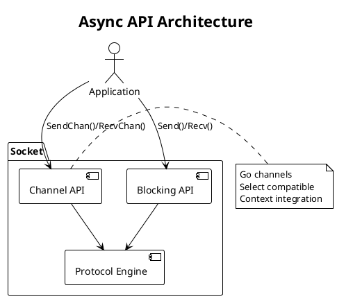

# PRD: Go-Native Async API (Phase 2)

Issue: sp-ms6.6
Status: Draft
Author: Claude
Date: 2026-01-27

## Overview

The Async API provides channel-based interfaces for non-blocking message operations in Go. We complement the blocking Send/Recv API with Go-native patterns using channels and contexts. Applications can select between sync and async styles or mix them based on their needs.



## Requirements

Table: Functional Requirements

| ID | Requirement |
|----|-------------|
| AA-1 | Expose send and receive channels for each socket type |
| AA-2 | Channels integrate with Go's select statement |
| AA-3 | Context cancellation propagates to channel operations |
| AA-4 | Deadlines/timeouts work via context |
| AA-5 | Both sync and async APIs usable on same socket |
| AA-6 | Channel close signals socket shutdown |

Table: Non-Functional Requirements

| ID | Requirement |
|----|-------------|
| NF-1 | Async API adds under 1μs overhead vs sync |
| NF-2 | No goroutine leaks from async operations |
| NF-3 | Channel operations are non-blocking when buffer available |
| NF-4 | Memory-safe (no races, no panics) |

## Design

### Channel Interface

We expose typed channels for async operations on each socket:

```go
// Socket extended with async interface
type Socket struct {
    // ... existing fields

    // Async channels (lazily created)
    asyncMu   sync.Mutex
    sendChan  chan []byte
    recvChan  chan []byte
}

// SendChan returns a channel for sending messages.
// Writing to this channel queues the message for transmission.
// The channel is buffered; size configurable via options.
// Close the socket to close this channel.
func (s *Socket) SendChan() chan<- []byte

// RecvChan returns a channel for receiving messages.
// Reading from this channel receives the next message.
// The channel is buffered; size configurable via options.
// Closed when socket closes.
func (s *Socket) RecvChan() <-chan []byte
```

### Channel Creation and Lifecycle

We create channels lazily on first access:

```go
func (s *Socket) SendChan() chan<- []byte {
    s.asyncMu.Lock()
    defer s.asyncMu.Unlock()

    if s.sendChan == nil {
        s.sendChan = make(chan []byte, s.config.AsyncSendBuffer)
        s.wg.Add(1)
        go s.sendPump()
    }
    return s.sendChan
}

func (s *Socket) RecvChan() <-chan []byte {
    s.asyncMu.Lock()
    defer s.asyncMu.Unlock()

    if s.recvChan == nil {
        s.recvChan = make(chan []byte, s.config.AsyncRecvBuffer)
        s.wg.Add(1)
        go s.recvPump()
    }
    return s.recvChan
}
```

### Context Integration

We provide context-aware methods for cancellation and deadlines:

```go
// SendCtx sends with context-based cancellation.
// Returns immediately if context is cancelled.
func (s *Socket) SendCtx(ctx context.Context, data []byte) error {
    select {
    case s.SendChan() <- data:
        return nil
    case <-ctx.Done():
        return ctx.Err()
    case <-s.ctx.Done():
        return ErrClosed
    }
}

// RecvCtx receives with context-based cancellation.
func (s *Socket) RecvCtx(ctx context.Context) ([]byte, error) {
    select {
    case data, ok := <-s.RecvChan():
        if !ok {
            return nil, ErrClosed
        }
        return data, nil
    case <-ctx.Done():
        return nil, ctx.Err()
    case <-s.ctx.Done():
        return nil, ErrClosed
    }
}
```

### Usage with Select

The channel interface enables Go-native patterns:

```go
// Multiplexing multiple sockets
func handleMultiple(sockets []*Socket) {
    cases := make([]reflect.SelectCase, len(sockets)+1)

    for i, s := range sockets {
        cases[i] = reflect.SelectCase{
            Dir:  reflect.SelectRecv,
            Chan: reflect.ValueOf(s.RecvChan()),
        }
    }
    // Add timeout case
    timeout := time.After(10 * time.Second)
    cases[len(sockets)] = reflect.SelectCase{
        Dir:  reflect.SelectRecv,
        Chan: reflect.ValueOf(timeout),
    }

    chosen, value, ok := reflect.Select(cases)
    // Handle result based on chosen index
}

// Simple select usage
func handleWithTimeout(s *Socket, timeout time.Duration) ([]byte, error) {
    select {
    case data := <-s.RecvChan():
        return data, nil
    case <-time.After(timeout):
        return nil, ErrTimeout
    }
}

// Fan-in from multiple sources
func fanIn(sources ...*Socket) <-chan []byte {
    out := make(chan []byte)

    for _, s := range sources {
        go func(sock *Socket) {
            for data := range sock.RecvChan() {
                out <- data
            }
        }(s)
    }

    return out
}
```

### Sync/Async Relationship

Both APIs work on the same socket. We note that messages go to either sync or async consumer, not both. Order is preserved within each receive path. Closing the socket closes all channels.

```go
// Sync and async can be mixed
func mixedUsage(s *Socket) {
    // Start receiving async
    go func() {
        for data := range s.RecvChan() {
            process(data)
        }
    }()

    // Send synchronously
    s.Send([]byte("hello"))

    // Or send async
    s.SendChan() <- []byte("world")
}
```

### Configuration

```go
// Async API options
func WithAsyncSendBuffer(size int) Option {
    return func(c *socketConfig) {
        c.AsyncSendBuffer = size
    }
}

func WithAsyncRecvBuffer(size int) Option {
    return func(c *socketConfig) {
        c.AsyncRecvBuffer = size
    }
}

// Defaults
const (
    DefaultAsyncSendBuffer = 16
    DefaultAsyncRecvBuffer = 16
)
```

### Pattern-Specific Considerations

Table: Channel Availability by Pattern

| Pattern | Send Channel | Recv Channel | Notes |
|---------|--------------|--------------|-------|
| REQ | Yes | Yes | Send triggers recv expectation |
| REP | Yes | Yes | Recv must precede send |
| PUB | Yes | No | Publishers do not receive |
| SUB | No | Yes | Subscribers do not send |
| PUSH | Yes | No | One-way send |
| PULL | No | Yes | One-way receive |
| SURVEYOR | Yes | Yes | Recv collects responses |
| RESPONDENT | Yes | Yes | Like REP |
| BUS | Yes | Yes | Bidirectional |
| PAIR | Yes | Yes | Bidirectional |

### Error Handling

Errors surface through the channel or context:

```go
// Option 1: Check context error
data, err := s.RecvCtx(ctx)
if err != nil {
    if errors.Is(err, context.DeadlineExceeded) {
        // Timeout
    } else if errors.Is(err, context.Canceled) {
        // Cancelled
    } else if errors.Is(err, ErrClosed) {
        // Socket closed
    }
}

// Option 2: Channel close indicates shutdown
data, ok := <-s.RecvChan()
if !ok {
    // Socket closed
}
```

### Migration Guide

We provide guidance for transitioning from sync to async:

```go
// Sync (blocking)
data, err := s.Recv()

// Async with select
select {
case data := <-s.RecvChan():
    // Process
case <-ctx.Done():
    // Cancelled
}

// Async with timeout
ctx, cancel := context.WithTimeout(context.Background(), 5*time.Second)
defer cancel()
data, err := s.RecvCtx(ctx)
```

## Testing Strategy

Table: Unit Tests

| Test | Description |
|------|-------------|
| TestSendChanBasic | Send via channel works |
| TestRecvChanBasic | Recv via channel works |
| TestSendCtxCancel | Context cancellation stops send |
| TestRecvCtxTimeout | Context timeout works |
| TestChannelClose | Socket close closes channels |
| TestMixedSyncAsync | Both APIs work together |

Table: Integration Tests

| Test | Description |
|------|-------------|
| TestAsyncReqRep | Full exchange using channels |
| TestAsyncFanIn | Multiple sources to one consumer |
| TestAsyncSelect | Select across multiple sockets |
| TestAsyncPubSub | Pub/Sub with channel interface |

Table: Benchmarks

| Benchmark | Target |
|-----------|--------|
| BenchmarkAsyncSend | < 100ns channel send |
| BenchmarkAsyncRecv | < 100ns channel recv |
| BenchmarkAsyncVsSync | < 1μs overhead |
| BenchmarkAsyncSelect | Efficient multi-socket select |

## Acceptance Criteria

We consider this PRD complete when:

1. Send/Recv channels work for basic async operations
2. Context integration enables cancellation and timeouts
3. Channels work with Go's select
4. Sync and async APIs are usable together
5. Shutdown closes channels cleanly with no leaks
6. GoDoc, examples, and migration guide exist
7. Benchmarks show overhead under 1μs vs sync

## Dependencies

We depend on Socket API (sp-ms6.4) and all protocol implementations for pattern-specific behavior.

## References

- [Go Channels](https://go.dev/doc/effective_go#channels)
- [Go Context](https://pkg.go.dev/context)
- [Go Select](https://go.dev/tour/concurrency/5)
- SP ARCHITECTURE.md, Phase 3: Async API section
