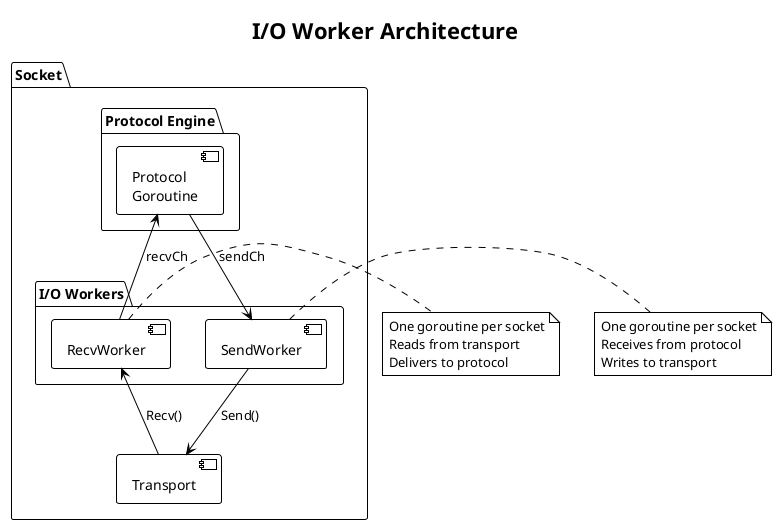
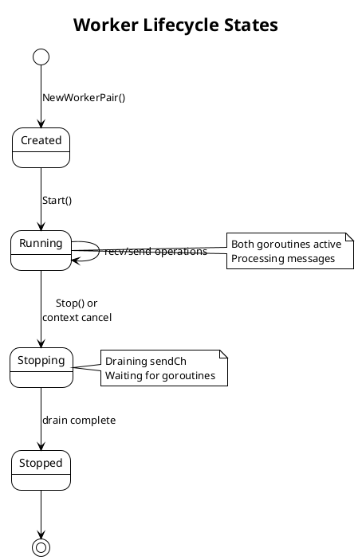

# PRD: I/O Workers

Issue: sp-ms6.3
Status: Draft
Author: Claude
Date: 2026-01-27

## Overview

I/O Workers are dedicated goroutines that handle raw syscall operations for transport communication. Each socket has exactly one recv worker and one send worker, isolating I/O operations from protocol logic. Workers communicate with the protocol engine via channels, providing natural backpressure and clean separation of concerns.



## Requirements

Table: Functional Requirements

| ID | Requirement |
|----|-------------|
| IO-1 | One recv worker goroutine per socket reads from transport |
| IO-2 | One send worker goroutine per socket writes to transport |
| IO-3 | Workers communicate with protocol engine via channels |
| IO-4 | Workers handle transport errors (EAGAIN, connection drops) |
| IO-5 | Workers respect socket close and shutdown cleanly |
| IO-6 | Workers preserve message boundaries from transport layer |

Table: Non-Functional Requirements

| ID | Requirement |
|----|-------------|
| NF-1 | Worker startup below 1ms from socket open to ready |
| NF-2 | Worker shutdown below 100ms with graceful drain |
| NF-3 | Zero-copy message handoff where possible |
| NF-4 | No goroutine leaks on socket close |
| NF-5 | No blocking of protocol engine on transport slowness |

## Design

### Recv Worker

The recv worker continuously reads from the transport and delivers messages to the protocol engine.

```go
// RecvWorker reads messages from transport and delivers to protocol.
type RecvWorker struct {
    transport transport.Transport
    recvCh    chan<- *Message       // Delivers to protocol engine
    pool      *BufferPool

    // Lifecycle
    ctx       context.Context
    cancel    context.CancelFunc
    done      chan struct{}

    // Statistics
    msgsRecv  atomic.Uint64
    bytesRecv atomic.Uint64
    errors    atomic.Uint64
}

// NewRecvWorker creates a recv worker for the given transport.
func NewRecvWorker(t transport.Transport, recvCh chan<- *Message, pool *BufferPool) *RecvWorker

// Start begins the recv worker goroutine.
// Returns immediately; worker runs until Stop() or context cancellation.
func (w *RecvWorker) Start(ctx context.Context)

// Stop signals the worker to stop and waits for shutdown.
// Blocks until worker goroutine exits.
func (w *RecvWorker) Stop()

// Stats returns worker statistics.
func (w *RecvWorker) Stats() RecvWorkerStats
```

We implement the recv worker loop as follows:

```go
func (w *RecvWorker) run() {
    defer close(w.done)
    defer w.transport.Close()

    for {
        // Check for shutdown
        select {
        case <-w.ctx.Done():
            return
        default:
        }

        // Set read deadline to allow periodic shutdown checks
        w.transport.SetReadDeadline(time.Now().Add(100 * time.Millisecond))

        // Read from transport
        data, addr, err := w.transport.Recv()
        if err != nil {
            if isTimeout(err) {
                continue  // Check shutdown, then retry
            }
            if isClosed(err) {
                return
            }
            w.errors.Add(1)
            // Log error, continue reading
            continue
        }

        // Wrap in Message with buffer from pool
        msg := w.wrapMessage(data, addr)

        // Deliver to protocol (may block if channel full)
        select {
        case w.recvCh <- msg:
            w.msgsRecv.Add(1)
            w.bytesRecv.Add(uint64(len(data)))
        case <-w.ctx.Done():
            msg.Release()
            return
        }
    }
}
```

### Send Worker

The send worker receives messages from the protocol engine and writes them to the transport.

```go
// SendWorker writes messages from protocol to transport.
type SendWorker struct {
    transport transport.Transport
    sendCh    <-chan *Message       // Receives from protocol engine

    // Lifecycle
    ctx       context.Context
    cancel    context.CancelFunc
    done      chan struct{}

    // Statistics
    msgsSent  atomic.Uint64
    bytesSent atomic.Uint64
    errors    atomic.Uint64
}

// NewSendWorker creates a send worker for the given transport.
func NewSendWorker(t transport.Transport, sendCh <-chan *Message) *SendWorker

// Start begins the send worker goroutine.
func (w *SendWorker) Start(ctx context.Context)

// Stop signals the worker to stop and waits for shutdown.
// Drains pending messages before exiting.
func (w *SendWorker) Stop()

// Stats returns worker statistics.
func (w *SendWorker) Stats() SendWorkerStats
```

We implement the send worker loop as follows:

```go
func (w *SendWorker) run() {
    defer close(w.done)

    for {
        select {
        case msg, ok := <-w.sendCh:
            if !ok {
                // Channel closed, drain complete
                return
            }

            // Write to transport
            n, err := w.transport.Send(msg.Data, msg.Addr)
            if err != nil {
                w.errors.Add(1)
                // Log error
            } else {
                w.msgsSent.Add(1)
                w.bytesSent.Add(uint64(n))
            }

            // Release buffer back to pool
            msg.Release()

        case <-w.ctx.Done():
            // Drain remaining messages
            w.drain()
            return
        }
    }
}

func (w *SendWorker) drain() {
    for {
        select {
        case msg, ok := <-w.sendCh:
            if !ok {
                return
            }
            // Best-effort send during shutdown
            w.transport.Send(msg.Data, msg.Addr)
            msg.Release()
        default:
            return
        }
    }
}
```

### Worker Pair

A WorkerPair manages both workers for a connection, providing unified lifecycle control.

```go
// WorkerPair manages recv and send workers for a connection.
type WorkerPair struct {
    recv     *RecvWorker
    send     *SendWorker

    recvCh   chan *Message   // Buffered channel to protocol
    sendCh   chan *Message   // Buffered channel from protocol

    ctx      context.Context
    cancel   context.CancelFunc
}

// NewWorkerPair creates a worker pair for the given transport.
func NewWorkerPair(t transport.Transport, pool *BufferPool, cfg WorkerConfig) *WorkerPair

// Start begins both worker goroutines.
func (wp *WorkerPair) Start()

// Stop signals both workers to stop and waits for shutdown.
func (wp *WorkerPair) Stop()

// RecvCh returns the channel for receiving messages from transport.
// Protocol engine reads from this channel.
func (wp *WorkerPair) RecvCh() <-chan *Message

// SendCh returns the channel for sending messages to transport.
// Protocol engine writes to this channel.
func (wp *WorkerPair) SendCh() chan<- *Message

// Stats returns combined statistics for both workers.
func (wp *WorkerPair) Stats() WorkerPairStats
```

### Channel Sizing and Backpressure

Table: Channel Configuration

| Channel | Buffer Size | Rationale |
|---------|-------------|-----------|
| recvCh | 16 messages | Absorbs recv bursts while protocol processes |
| sendCh | 16 messages | Allows protocol to queue sends without blocking |

We rely on channel backpressure for flow control. If the protocol engine processes slowly, recvCh fills and the recv worker blocks on channel send, which applies backpressure to the network as the recv syscall blocks. If the transport is slow, the send worker blocks on syscall, sendCh fills, and the protocol blocks when sending. This provides natural flow control without explicit signaling.

### Error Handling

```go
// Worker error types
var (
    // ErrWorkerStopped indicates the worker was explicitly stopped.
    ErrWorkerStopped = errors.New("worker: stopped")

    // ErrTransportClosed indicates the transport was closed.
    ErrTransportClosed = errors.New("worker: transport closed")
)

// Error classification for transport errors
func isTimeout(err error) bool    // True for deadline exceeded
func isClosed(err error) bool     // True for closed connection
func isTemporary(err error) bool  // True for EAGAIN, EINTR, etc.
```

Table: Error Handling Strategy

| Error Type | Recv Worker Action | Send Worker Action |
|------------|-------------------|-------------------|
| Timeout | Continue (retry recv) | N/A (channels do not timeout) |
| Closed | Exit worker | Exit worker |
| Temporary | Retry immediately | Retry immediately |
| Permanent | Log, increment error counter, continue | Log, increment error counter, drop message |

### Worker Configuration

```go
// WorkerConfig holds worker configuration.
type WorkerConfig struct {
    // RecvBufSize is the recvCh buffer size.
    // Default: 16
    RecvBufSize int

    // SendBufSize is the sendCh buffer size.
    // Default: 16
    SendBufSize int

    // ReadTimeout is the recv deadline for shutdown checks.
    // Default: 100ms
    ReadTimeout time.Duration

    // DrainTimeout is the max time to drain on shutdown.
    // Default: 1s
    DrainTimeout time.Duration
}

// DefaultWorkerConfig returns sensible defaults.
func DefaultWorkerConfig() WorkerConfig
```

### Lifecycle State Machine



### Integration with Connection Registry

When a connection registers, we create and start a WorkerPair:

```go
// In ConnRegistry.Register:
func (r *ConnRegistry) Register(t transport.Transport, sock *Socket) (*ConnEntry, error) {
    wp := NewWorkerPair(t, sock.bufferPool, sock.workerConfig)
    wp.Start()

    entry := &ConnEntry{
        Transport: t,
        Socket:    sock,
        SendCh:    wp.SendCh(),
        RecvCh:    wp.RecvCh(),
        workers:   wp,
    }

    // ... register entry
    return entry, nil
}

// In ConnRegistry.Unregister:
func (r *ConnRegistry) Unregister(id ConnID) bool {
    entry := r.conns[id]
    entry.workers.Stop()  // Stops both workers, drains channels
    // ... cleanup
}
```

## Testing Strategy

Table: Unit Tests

| Test | Description |
|------|-------------|
| TestRecvWorkerBasic | Recv worker delivers messages to channel |
| TestRecvWorkerTimeout | Recv worker handles read timeouts gracefully |
| TestRecvWorkerClose | Recv worker exits on transport close |
| TestRecvWorkerShutdown | Recv worker stops on context cancel |
| TestSendWorkerBasic | Send worker writes messages from channel |
| TestSendWorkerDrain | Send worker drains pending messages on shutdown |
| TestSendWorkerClose | Send worker handles transport close |
| TestWorkerPairLifecycle | Start and stop both workers correctly |
| TestBackpressure | Full channel blocks sender appropriately |
| TestNoGoroutineLeak | All goroutines exit on socket close |

Table: Integration Tests

| Test | Description |
|------|-------------|
| TestWorkerTransportIntegration | Workers with real Unix transport |
| TestWorkerProtocolHandoff | Message flow from transport to protocol |
| TestConcurrentConnections | Multiple worker pairs simultaneously |

Table: Benchmarks

| Benchmark | Target |
|-----------|--------|
| BenchmarkRecvWorkerThroughput | > 500K msg/sec (empty messages) |
| BenchmarkSendWorkerThroughput | > 500K msg/sec (empty messages) |
| BenchmarkWorkerLatency | < 5μs channel-to-channel |
| BenchmarkWorkerStartStop | < 1ms start, < 100ms stop |

## Acceptance Criteria

We consider this PRD complete when:

1. RecvWorker implements continuous read loop with shutdown handling
2. SendWorker implements channel-driven write loop with drain
3. WorkerPair provides unified lifecycle management
4. Backpressure works via channel fullness
5. Shutdown completes cleanly with no goroutine leaks
6. Error handling covers timeout, closed, and temporary errors
7. Benchmarks meet throughput and latency targets
8. GoDoc comments exist on all exported types and methods

## Dependencies

We depend on the Transport Abstraction Layer (sp-ms6.1) for the Transport interface and Shared Infrastructure (sp-ms6.7) for BufferPool and Message types.

## References

- SP ARCHITECTURE.md, I/O Workers section
- [Go context package](https://pkg.go.dev/context)
- [Go channels](https://go.dev/doc/effective_go#channels)
