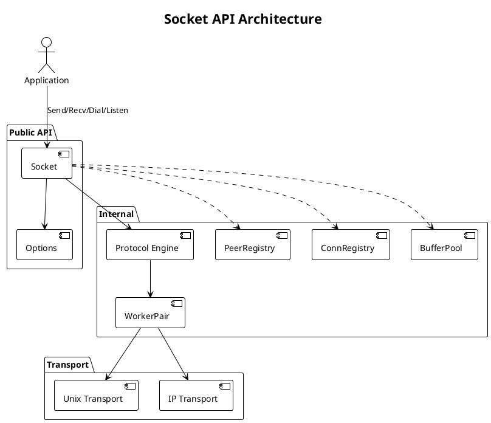
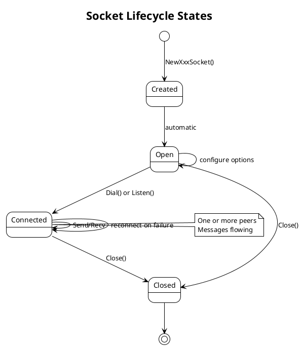

# PRD: Socket API and Blocking Interface

Issue: sp-ms6.4
Status: Draft
Author: Claude
Date: 2026-01-27

## Overview

The Socket API provides the public interface for SP applications. We present a traditional blocking Send()/Recv() API while internally coordinating protocol engines, I/O workers, and transports. This layer handles socket lifecycle (open, dial, listen, close) and error propagation from lower layers.



## Requirements

Table: Functional Requirements

| ID | Requirement |
|----|-------------|
| SA-1 | Socket factory creates protocol-specific sockets (REQ, REP, etc.) |
| SA-2 | Blocking Send() queues message and returns when sent or error |
| SA-3 | Blocking Recv() blocks until message received or error |
| SA-4 | Dial() connects to remote address |
| SA-5 | Listen() binds to local address and accepts connections |
| SA-6 | Close() releases all resources and cancels pending operations |
| SA-7 | Options configurable per-socket (timeouts, buffer sizes) |
| SA-8 | Context support for cancellation and deadlines |

Table: Non-Functional Requirements

| ID | Requirement |
|----|-------------|
| NF-1 | API surface minimal and intuitive |
| NF-2 | Error messages descriptive and actionable |
| NF-3 | No resource leaks on any code path |
| NF-4 | All operations are goroutine-safe |
| NF-5 | No panics from user input |

## Design

### Socket Factory

Applications create sockets through factory functions:

```go
// NewReqSocket creates a REQ (requester) socket.
func NewReqSocket(opts ...Option) (*Socket, error)

// NewRepSocket creates a REP (replier) socket.
func NewRepSocket(opts ...Option) (*Socket, error)

// Future patterns (Phase 2):
// func NewPubSocket(opts ...Option) (*Socket, error)
// func NewSubSocket(opts ...Option) (*Socket, error)
// func NewPushSocket(opts ...Option) (*Socket, error)
// func NewPullSocket(opts ...Option) (*Socket, error)
// func NewSurveyorSocket(opts ...Option) (*Socket, error)
// func NewRespondentSocket(opts ...Option) (*Socket, error)
// func NewBusSocket(opts ...Option) (*Socket, error)
// func NewPairSocket(opts ...Option) (*Socket, error)
```

### Socket Interface

```go
// Socket is the primary interface for SP communication.
type Socket struct {
    // Protocol-specific implementation
    proto    Protocol

    // Transport management
    listener Listener
    dialers  []*Dialer

    // Shared infrastructure
    pool     *BufferPool
    peers    *PeerRegistry
    conns    *ConnRegistry

    // Lifecycle
    ctx      context.Context
    cancel   context.CancelFunc
    closed   atomic.Bool
    closeMu  sync.Mutex
    wg       sync.WaitGroup  // Tracks active goroutines
}

// Protocol defines the interface that protocol engines implement.
type Protocol interface {
    // Send queues a message for transmission.
    Send(data []byte) error

    // Recv waits for and returns a received message.
    Recv() ([]byte, error)

    // Close shuts down the protocol engine.
    Close() error

    // Info returns protocol metadata.
    Info() ProtocolInfo
}

// ProtocolInfo describes a protocol.
type ProtocolInfo struct {
    Name       string   // e.g., "req", "rep"
    SelfID     uint16   // Protocol number
    PeerID     uint16   // Expected peer protocol number
    CanSend    bool
    CanRecv    bool
}
```

### Core Operations

```go
// Send transmits a message.
// Blocks until the message is queued for transmission or an error occurs.
// Returns ErrClosed if socket is closed.
// Returns ErrTimeout if send timeout is exceeded.
func (s *Socket) Send(data []byte) error {
    if s.closed.Load() {
        return ErrClosed
    }
    return s.proto.Send(data)
}

// Recv waits for and returns a message.
// Blocks until a message is available or an error occurs.
// Returns ErrClosed if socket is closed.
// Returns ErrTimeout if recv timeout is exceeded.
func (s *Socket) Recv() ([]byte, error) {
    if s.closed.Load() {
        return nil, ErrClosed
    }
    return s.proto.Recv()
}

// SendMsg sends a message with explicit options.
// Allows per-message configuration without changing socket options.
func (s *Socket) SendMsg(msg *Message, opts SendOptions) error

// RecvMsg receives a message with metadata.
// Returns full message including source address.
func (s *Socket) RecvMsg() (*Message, error)
```

### Connection Management

```go
// Dial connects to a remote endpoint.
// The address format depends on transport: "unix:///path" or "ip://host:port".
// Non-blocking: returns immediately, connection happens in background.
func (s *Socket) Dial(addr string) error

// DialAndWait connects to a remote endpoint and waits for connection.
// Blocks until connected or error.
func (s *Socket) DialAndWait(addr string) error

// Listen binds to a local address and accepts connections.
// The address format depends on transport: "unix:///path" or "ip://host:port".
func (s *Socket) Listen(addr string) error
```

### Socket Lifecycle



```go
// Close shuts down the socket.
// Cancels all pending operations and releases resources.
// Blocks until all goroutines have exited.
// Safe to call multiple times.
func (s *Socket) Close() error {
    s.closeMu.Lock()
    if s.closed.Swap(true) {
        s.closeMu.Unlock()
        return nil  // Already closed
    }
    s.closeMu.Unlock()

    // Cancel context to signal shutdown
    s.cancel()

    // Close listener
    if s.listener != nil {
        s.listener.Close()
    }

    // Close all connections
    s.conns.CloseAll(s)

    // Close protocol engine
    s.proto.Close()

    // Wait for all goroutines
    s.wg.Wait()

    return nil
}

// IsClosed returns true if the socket has been closed.
func (s *Socket) IsClosed() bool {
    return s.closed.Load()
}
```

### Options Pattern

```go
// Option configures a socket.
type Option func(*socketConfig)

// socketConfig holds socket configuration.
type socketConfig struct {
    // Timeouts
    SendTimeout time.Duration
    RecvTimeout time.Duration
    DialTimeout time.Duration

    // Buffer sizes
    SendBuffer int
    RecvBuffer int

    // Connection behavior
    Reconnect        bool
    ReconnectMinTime time.Duration
    ReconnectMaxTime time.Duration

    // Transport options
    MaxMessageSize int
}

// WithSendTimeout sets the send timeout.
func WithSendTimeout(d time.Duration) Option {
    return func(c *socketConfig) {
        c.SendTimeout = d
    }
}

// WithRecvTimeout sets the recv timeout.
func WithRecvTimeout(d time.Duration) Option {
    return func(c *socketConfig) {
        c.RecvTimeout = d
    }
}

// WithReconnect enables automatic reconnection on dial.
func WithReconnect(min, max time.Duration) Option {
    return func(c *socketConfig) {
        c.Reconnect = true
        c.ReconnectMinTime = min
        c.ReconnectMaxTime = max
    }
}

// WithMaxMessageSize sets the maximum message size.
func WithMaxMessageSize(size int) Option {
    return func(c *socketConfig) {
        c.MaxMessageSize = size
    }
}
```

### Context Support

```go
// SendContext sends with context for cancellation/deadline.
func (s *Socket) SendContext(ctx context.Context, data []byte) error

// RecvContext receives with context for cancellation/deadline.
func (s *Socket) RecvContext(ctx context.Context) ([]byte, error)
```

### Error Types

```go
var (
    // ErrClosed indicates the socket has been closed.
    ErrClosed = errors.New("socket: closed")

    // ErrTimeout indicates an operation timed out.
    ErrTimeout = errors.New("socket: timeout")

    // ErrAlreadyListening indicates the socket is already listening.
    ErrAlreadyListening = errors.New("socket: already listening")

    // ErrInvalidAddress indicates the address format is invalid.
    ErrInvalidAddress = errors.New("socket: invalid address")

    // ErrProtocolMismatch indicates peer uses incompatible protocol.
    ErrProtocolMismatch = errors.New("socket: protocol mismatch")
)

// SocketError wraps errors with socket context.
type SocketError struct {
    Op   string  // "send", "recv", "dial", "listen", "close"
    Addr string  // Address if applicable
    Err  error   // Underlying error
}

func (e *SocketError) Error() string {
    if e.Addr != "" {
        return fmt.Sprintf("socket %s %s: %v", e.Op, e.Addr, e.Err)
    }
    return fmt.Sprintf("socket %s: %v", e.Op, e.Err)
}

func (e *SocketError) Unwrap() error { return e.Err }
```

### Address Parsing

We support two address formats:

Table: Address Formats

| Transport | Format | Example |
|-----------|--------|---------|
| Unix | unix:///path/to/socket | unix:///tmp/sp.sock |
| IP | ip://host:port | ip://127.0.0.1:5555 |
| IP (IPv6) | ip://[ipv6]:port | ip://[::1]:5555 |

```go
// ParseAddr parses an address string into a transport Addr.
func ParseAddr(s string) (Addr, error)
```

### Usage Example

```go
// Server (REP socket)
rep, err := sp.NewRepSocket()
if err != nil {
    log.Fatal(err)
}
defer rep.Close()

if err := rep.Listen("unix:///tmp/service.sock"); err != nil {
    log.Fatal(err)
}

for {
    data, err := rep.Recv()
    if err != nil {
        break
    }
    fmt.Printf("Received: %s\n", data)

    if err := rep.Send([]byte("pong")); err != nil {
        break
    }
}

// Client (REQ socket)
req, err := sp.NewReqSocket(
    sp.WithSendTimeout(5 * time.Second),
    sp.WithRecvTimeout(5 * time.Second),
)
if err != nil {
    log.Fatal(err)
}
defer req.Close()

if err := req.Dial("unix:///tmp/service.sock"); err != nil {
    log.Fatal(err)
}

if err := req.Send([]byte("ping")); err != nil {
    log.Fatal(err)
}

reply, err := req.Recv()
if err != nil {
    log.Fatal(err)
}
fmt.Printf("Reply: %s\n", reply)
```

## Testing Strategy

Table: Unit Tests

| Test | Description |
|------|-------------|
| TestSocketCreate | Factory functions create correct socket types |
| TestSocketOptions | Options pattern configures sockets correctly |
| TestSocketClose | Close releases resources and cancels ops |
| TestSocketCloseIdempotent | Multiple Close() calls safe |
| TestSocketDialInvalidAddr | Invalid address returns error |
| TestSocketListenAlreadyListening | Double listen returns error |
| TestParseAddr | Address parsing for all formats |
| TestSocketContextCancel | Context cancellation works |

Table: Integration Tests

| Test | Description |
|------|-------------|
| TestSocketReqRep | Full REQ/REP exchange |
| TestSocketReconnect | Automatic reconnection on disconnect |
| TestSocketMultipleClients | Multiple clients to one server |
| TestSocketUnixTransport | Socket API with Unix transport |
| TestSocketIPTransport | Socket API with IP transport |

Table: Benchmarks

| Benchmark | Target |
|-----------|--------|
| BenchmarkSocketSendRecv | < 25μs round-trip |
| BenchmarkSocketCreate | < 1ms socket creation |
| BenchmarkSocketClose | < 10ms socket close |

## Acceptance Criteria

We consider this PRD complete when:

1. Factory functions create all socket types
2. Send/Recv operations complete correctly
3. Dial/Listen connection management is functional
4. Close shuts down cleanly with no leaks
5. Options pattern configures sockets
6. Context cancellation works
7. Error messages are descriptive and actionable
8. All operations are goroutine-safe
9. GoDoc comments and usage examples exist

## Dependencies

We depend on the Transport Abstraction Layer (sp-ms6.1), Shared Infrastructure (sp-ms6.7), I/O Workers (sp-ms6.3), and REQ/REP Protocol Engine (sp-ms6.2).

## References

- SP ARCHITECTURE.md, Socket API Layer section
- [Go context package](https://pkg.go.dev/context)
- [Go options pattern](https://dave.cheney.net/2014/10/17/functional-options-for-friendly-apis)
