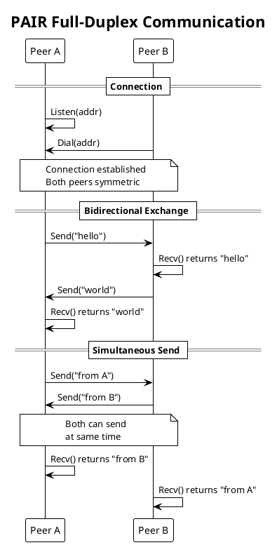
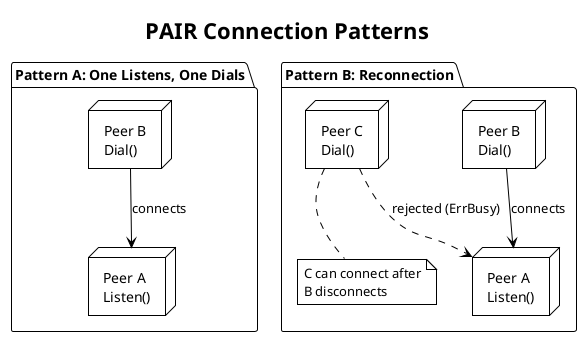

# PRD: PAIR Protocol Engine

Issue: sp-4qz.9
Status: Draft
Author: Claude
Date: 2026-01-28

## Overview

The PAIR protocol implements one-to-one full-duplex communication. Two peers connect and exchange messages bidirectionally without role distinction. Either peer can send or receive at any time. We use this pattern for direct point-to-point communication where both endpoints need unrestricted bidirectional messaging.

Unlike REQ/REP with strict send/recv alternation or PUB/SUB with sender/receiver roles, PAIR peers are completely symmetric. The pattern enforces exactly two endpoints—additional connection attempts are rejected.



## Requirements

Table: Functional Requirements

| ID | Requirement |
|----|-------------|
| PA-1 | PAIR socket connects to exactly one peer |
| PA-2 | Both endpoints can send and receive messages |
| PA-3 | Additional connection attempts are rejected |
| PA-4 | No state machine (always ready to send and receive) |
| PA-5 | Messages from each peer arrive in send order |
| PA-6 | Either peer can initiate communication |
| PA-7 | One peer listens, the other dials to establish connection |

Table: Non-Functional Requirements

| ID | Requirement |
|----|-------------|
| NF-1 | Message latency below 10μs on local Unix transport |
| NF-2 | Zero-copy message path where possible |
| NF-3 | All socket operations are goroutine-safe |
| NF-4 | Clean shutdown with no goroutine leaks |

## Design

### Protocol Characteristics

PAIR is the simplest symmetric pattern:

Table: PAIR vs Other Patterns

| Aspect | PAIR | REQ/REP | PUB/SUB | BUS |
|--------|------|---------|---------|-----|
| Endpoints | 2 | N:1 | 1:N | N:N |
| Roles | Symmetric | Asymmetric | Asymmetric | Symmetric |
| Direction | Bidirectional | Alternating | Unidirectional | Bidirectional |
| State Machine | No | Yes | No | No |
| Connection | Exclusive | Multiple | Multiple | Multiple |

### PAIR Socket Implementation

```go
// PairSocket provides exclusive bidirectional communication.
type PairSocket struct {
    // Base socket functionality
    base   *BaseSocket

    // Peer management (exactly one peer)
    peerMu sync.Mutex
    peer   *Peer

    // Channels
    sendCh chan<- *Message  // To I/O workers
    recvCh <-chan *Message  // From I/O workers
}

// NewPairSocket creates a PAIR socket.
func NewPairSocket(cfg PairConfig) (*PairSocket, error)

// Listen starts listening for a peer connection.
// Only one peer can connect.
func (s *PairSocket) Listen(addr string) error

// Dial connects to a listening peer.
// Returns error if already connected.
func (s *PairSocket) Dial(addr string) error

// Send sends a message to the connected peer.
// Blocks if peer cannot receive (back-pressure).
// Returns ErrNotConnected if no peer is connected.
// Returns ErrClosed if socket is closed.
func (s *PairSocket) Send(data []byte) error

// SendTimeout sends with a timeout.
// Returns ErrTimeout if peer cannot receive in time.
func (s *PairSocket) SendTimeout(data []byte, timeout time.Duration) error

// Recv receives a message from the connected peer.
// Blocks until a message arrives.
// Returns ErrNotConnected if no peer is connected.
// Returns ErrClosed if socket is closed.
func (s *PairSocket) Recv() ([]byte, error)

// RecvTimeout receives with a timeout.
// Returns ErrTimeout if no message arrives in time.
func (s *PairSocket) RecvTimeout(timeout time.Duration) ([]byte, error)

// Close closes the socket and releases resources.
func (s *PairSocket) Close() error
```

We implement the PAIR socket:

```go
func (s *PairSocket) Send(data []byte) error {
    s.peerMu.Lock()
    peer := s.peer
    s.peerMu.Unlock()

    if peer == nil {
        return ErrNotConnected
    }

    msg := s.base.pool.NewMessage(data)
    msg.PeerID = peer.ID

    select {
    case s.sendCh <- msg:
        return nil
    case <-s.base.ctx.Done():
        msg.Release()
        return ErrClosed
    }
}

func (s *PairSocket) SendTimeout(data []byte, timeout time.Duration) error {
    s.peerMu.Lock()
    peer := s.peer
    s.peerMu.Unlock()

    if peer == nil {
        return ErrNotConnected
    }

    msg := s.base.pool.NewMessage(data)
    msg.PeerID = peer.ID

    timer := time.NewTimer(timeout)
    defer timer.Stop()

    select {
    case s.sendCh <- msg:
        return nil
    case <-timer.C:
        msg.Release()
        return ErrTimeout
    case <-s.base.ctx.Done():
        msg.Release()
        return ErrClosed
    }
}

func (s *PairSocket) Recv() ([]byte, error) {
    select {
    case msg := <-s.recvCh:
        data := make([]byte, len(msg.Data))
        copy(data, msg.Data)
        msg.Release()
        return data, nil

    case <-s.base.ctx.Done():
        return nil, ErrClosed
    }
}

func (s *PairSocket) RecvTimeout(timeout time.Duration) ([]byte, error) {
    timer := time.NewTimer(timeout)
    defer timer.Stop()

    select {
    case msg := <-s.recvCh:
        data := make([]byte, len(msg.Data))
        copy(data, msg.Data)
        msg.Release()
        return data, nil

    case <-timer.C:
        return nil, ErrTimeout

    case <-s.base.ctx.Done():
        return nil, ErrClosed
    }
}
```

### Connection Management

PAIR enforces exclusive connection:

```go
// onPeerConnect handles incoming peer connection.
func (s *PairSocket) onPeerConnect(peer *Peer) error {
    s.peerMu.Lock()
    defer s.peerMu.Unlock()

    if s.peer != nil {
        // Already have a peer, reject connection
        return ErrBusy
    }

    s.peer = peer
    return nil
}

// onPeerDisconnect handles peer disconnection.
func (s *PairSocket) onPeerDisconnect(peerID PeerID) {
    s.peerMu.Lock()
    defer s.peerMu.Unlock()

    if s.peer != nil && s.peer.ID == peerID {
        s.peer = nil
    }
}
```

### Configuration

```go
// PairConfig holds PAIR socket configuration.
type PairConfig struct {
    // SendQueueSize is the send buffer size.
    // Default: 16.
    SendQueueSize int

    // RecvQueueSize is the receive buffer size.
    // Default: 16.
    RecvQueueSize int

    // SendTimeout is the default timeout for Send.
    // Default: 0 (no timeout, blocks indefinitely).
    SendTimeout time.Duration

    // RecvTimeout is the default timeout for Recv.
    // Default: 0 (no timeout, blocks indefinitely).
    RecvTimeout time.Duration
}
```

### Error Types

```go
var (
    // ErrNotConnected indicates no peer is connected.
    ErrNotConnected = errors.New("protocol: not connected")

    // ErrBusy indicates a peer is already connected.
    ErrBusy = errors.New("protocol: busy")

    // ErrTimeout indicates the operation timed out.
    ErrTimeout = errors.New("protocol: timeout")

    // ErrClosed indicates the socket has been closed.
    ErrClosed = errors.New("protocol: closed")
)
```

### Connection Patterns



## Testing Strategy

Table: Unit Tests

| Test | Description |
|------|-------------|
| TestPairSendRecv | Basic send and receive |
| TestPairBidirectional | Both peers send and receive |
| TestPairSimultaneous | Concurrent send from both sides |
| TestPairExclusive | Third connection rejected |
| TestPairNotConnected | Send/Recv before connection |
| TestPairReconnect | New peer after disconnect |
| TestPairSendTimeout | Timeout on blocked send |
| TestPairRecvTimeout | Timeout on receive |
| TestSocketClose | Clean shutdown |

Table: Integration Tests

| Test | Description |
|------|-------------|
| TestPairBasic | Full duplex with transport |
| TestPairHighThroughput | Sustained bidirectional traffic |
| TestPairDisconnect | Handle peer disconnection |
| TestPairUnixTransport | PAIR over Unix sockets |
| TestPairIPTransport | PAIR over IP sockets |

Table: Benchmarks

| Benchmark | Target |
|-----------|--------|
| BenchmarkPairLatency | < 10μs round-trip (Unix) |
| BenchmarkPairThroughput | > 200K messages/sec |
| BenchmarkPairBidirectional | > 100K messages/sec each direction |

## Acceptance Criteria

We consider this PRD complete when:

1. PAIR Socket implements Send and Recv bidirectionally
2. Listen and Dial establish exclusive connection
3. Additional connections are rejected with ErrBusy
4. ErrNotConnected returned when no peer connected
5. Timeout variants work correctly
6. Peer disconnection allows new connection
7. Clean shutdown with no goroutine leaks
8. Benchmarks meet latency and throughput targets
9. GoDoc comments exist on all exported types and methods

## Dependencies

We depend on the Transport Abstraction Layer, Shared Infrastructure (BufferPool, PeerRegistry), and I/O Workers.

## References

- [NNG PAIR Documentation](https://nng.nanomsg.org/man/tip/nng_pair.7.html)
- SP ARCHITECTURE.md, Protocol Engine section
- BACKGROUND/nng/nng-pair.md
