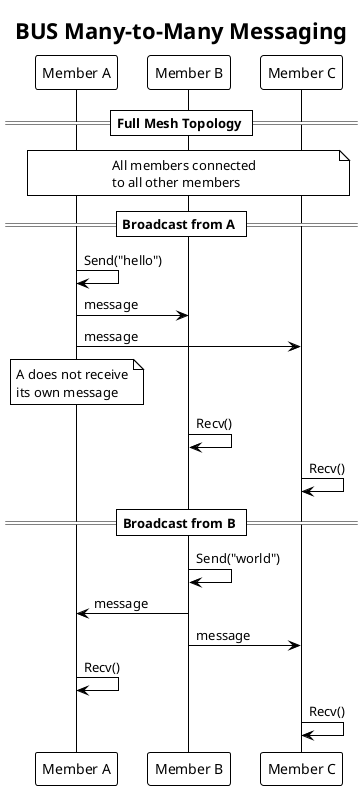
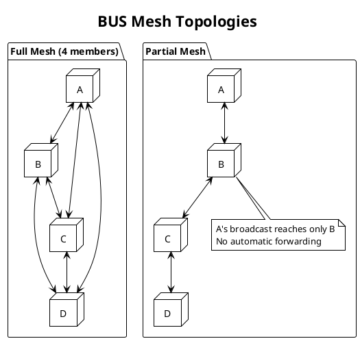
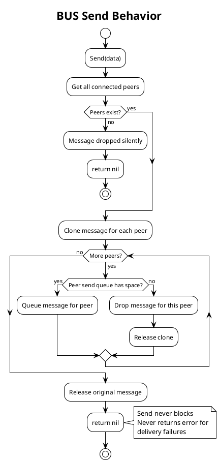

# PRD: BUS Protocol Engine

Issue: sp-4qz.8
Status: Draft
Author: Claude
Date: 2026-01-28

## Overview

The BUS protocol implements many-to-many symmetric messaging. Every BUS socket can both send and receive messages. When a member broadcasts, all directly connected peers receive the message. We use this pattern for peer-to-peer coordination, cluster communication, and scenarios where participants have equal roles.

Unlike PUB/SUB where publishers only send and subscribers only receive, BUS members are symmetric. Each member has identical capabilities. Messages do not loop back to the sender and do not forward beyond direct peers.

BUS uses best-effort delivery semantics. Send operations never block. If a peer cannot receive (full buffer or disconnected), the message is dropped for that peer.



## Requirements

Table: Functional Requirements

| ID | Requirement |
|----|-------------|
| BU-1 | BUS socket can send and receive messages |
| BU-2 | Sent messages are delivered to all directly connected peers |
| BU-3 | Messages are not echoed back to the sender |
| BU-4 | No state machine (always ready to send and receive) |
| BU-5 | Send never blocks (best-effort delivery) |
| BU-6 | Messages do not forward beyond direct peers |
| BU-7 | Members can listen for connections or dial to peers |

Table: Non-Functional Requirements

| ID | Requirement |
|----|-------------|
| NF-1 | Broadcast latency below 10μs per peer on local Unix transport |
| NF-2 | Zero-copy message path where possible |
| NF-3 | Peer selection completes in O(n) where n is peer count |
| NF-4 | All socket operations are goroutine-safe |
| NF-5 | Clean shutdown with no goroutine leaks |

## Design

### Protocol Characteristics

BUS is stateless and symmetric:

Table: BUS vs Other Patterns

| Aspect | PUB/SUB | BUS | REQ/REP |
|--------|---------|-----|---------|
| Topology | 1:N | N:N | N:1 |
| Roles | Asymmetric | Symmetric | Asymmetric |
| Direction | Unidirectional | Bidirectional | Bidirectional |
| State Machine | No | No | Yes |
| Loopback | N/A | Prevented | N/A |
| Delivery | Best-effort | Best-effort | Reliable |

### BUS Socket Implementation

```go
// BusSocket provides many-to-many symmetric messaging.
type BusSocket struct {
    // Base socket functionality
    base   *BaseSocket

    // Peer management
    peers  *PeerRegistry

    // Channels
    sendCh chan<- *Message  // To I/O workers
    recvCh <-chan *Message  // From I/O workers
}

// NewBusSocket creates a BUS socket.
func NewBusSocket(cfg BusConfig) (*BusSocket, error)

// Send broadcasts a message to all connected peers.
// Never blocks. Returns immediately.
// If a peer cannot receive, the message is dropped for that peer.
// Returns ErrClosed if socket is closed.
func (s *BusSocket) Send(data []byte) error

// Recv receives a message from any connected peer.
// Blocks until a message arrives.
// Returns ErrClosed if socket is closed.
func (s *BusSocket) Recv() ([]byte, error)

// RecvTimeout receives with a timeout.
// Returns ErrTimeout if no message arrives in time.
func (s *BusSocket) RecvTimeout(timeout time.Duration) ([]byte, error)

// Close closes the socket and releases resources.
func (s *BusSocket) Close() error
```

We implement broadcast with no-loopback semantics:

```go
func (s *BusSocket) Send(data []byte) error {
    peers := s.peers.All()
    if len(peers) == 0 {
        // No peers, message is dropped silently
        return nil
    }

    msg := s.base.pool.NewMessage(data)

    // Broadcast to all peers (no loopback since we're sending to peers only)
    for _, peer := range peers {
        clone := msg.Clone()
        clone.PeerID = peer.ID

        select {
        case s.sendCh <- clone:
            // Queued for sending
        default:
            // Peer busy, drop message for this peer
            clone.Release()
        }
    }

    msg.Release()
    return nil
}

func (s *BusSocket) Recv() ([]byte, error) {
    select {
    case msg := <-s.recvCh:
        data := make([]byte, len(msg.Data))
        copy(data, msg.Data)
        msg.Release()
        return data, nil

    case <-s.base.ctx.Done():
        return nil, ErrClosed
    }
}

func (s *BusSocket) RecvTimeout(timeout time.Duration) ([]byte, error) {
    timer := time.NewTimer(timeout)
    defer timer.Stop()

    select {
    case msg := <-s.recvCh:
        data := make([]byte, len(msg.Data))
        copy(data, msg.Data)
        msg.Release()
        return data, nil

    case <-timer.C:
        return nil, ErrTimeout

    case <-s.base.ctx.Done():
        return nil, ErrClosed
    }
}
```

### Mesh Topology

BUS members form a mesh topology. For all members to receive all broadcasts, a full mesh is required.



Table: Mesh Comparison

| Topology | Connections | Broadcast Scope | Use Case |
|----------|-------------|-----------------|----------|
| Full Mesh | N*(N-1)/2 | All members | Small clusters |
| Partial Mesh | Varies | Direct peers only | Large networks |
| Star | N-1 | Hub and spokes | Central coordinator |

### Connection Patterns

BUS supports flexible connection patterns:

```go
// Pattern 1: Each member listens, higher IDs dial to lower IDs
// Avoids duplicate connections
func setupFullMesh(members []*BusSocket, addrs []string) {
    for i, m := range members {
        m.Listen(addrs[i])
        for j := 0; j < i; j++ {
            m.Dial(addrs[j])
        }
    }
}

// Pattern 2: Hub-and-spoke
// Hub listens, all spokes dial to hub
func setupHubSpoke(hub *BusSocket, hubAddr string, spokes []*BusSocket) {
    hub.Listen(hubAddr)
    for _, spoke := range spokes {
        spoke.Dial(hubAddr)
    }
}
```

### Configuration

```go
// BusConfig holds BUS socket configuration.
type BusConfig struct {
    // SendQueueSize is the per-peer send queue size.
    // Messages dropped when queue full.
    // Default: 16.
    SendQueueSize int

    // RecvQueueSize is the receive buffer size.
    // Default: 128.
    RecvQueueSize int

    // RecvTimeout is the default timeout for Recv.
    // Default: 0 (no timeout).
    RecvTimeout time.Duration
}
```

### Error Types

```go
var (
    // ErrClosed indicates the socket has been closed.
    ErrClosed = errors.New("protocol: closed")

    // ErrTimeout indicates the operation timed out.
    ErrTimeout = errors.New("protocol: timeout")
)
```

### Best-Effort Delivery

BUS provides best-effort semantics:



## Testing Strategy

Table: Unit Tests

| Test | Description |
|------|-------------|
| TestBusSendNoPeers | Send with no peers returns nil |
| TestBusBroadcast | Message reaches all connected peers |
| TestBusNoLoopback | Sender does not receive own message |
| TestBusSymmetric | Both ends can send and receive |
| TestBusBestEffort | Slow peer dropped, others receive |
| TestBusRecv | Receive from any peer |
| TestBusRecvTimeout | Timeout when no messages |
| TestSocketClose | Clean shutdown |

Table: Integration Tests

| Test | Description |
|------|-------------|
| TestBusFullMesh | Three members, full mesh |
| TestBusPartialMesh | Linear chain, verify no forwarding |
| TestBusHubSpoke | Hub-and-spoke topology |
| TestBusConcurrent | Multiple simultaneous broadcasts |
| TestBusUnixTransport | BUS over Unix sockets |
| TestBusIPTransport | BUS over IP sockets |

Table: Benchmarks

| Benchmark | Target |
|-----------|--------|
| BenchmarkBusBroadcast10 | < 100μs for 10 peers (Unix) |
| BenchmarkBusBroadcast100 | < 1ms for 100 peers (Unix) |
| BenchmarkBusRecv | > 100K messages/sec |

## Acceptance Criteria

We consider this PRD complete when:

1. BUS Socket implements Send with broadcast to all peers
2. BUS Socket implements Recv for message reception
3. Messages do not loop back to sender
4. Send never blocks (best-effort delivery)
5. Messages dropped silently when peer cannot receive
6. Both Listen and Dial supported for connection
7. Clean shutdown with no goroutine leaks
8. Benchmarks meet latency and throughput targets
9. GoDoc comments exist on all exported types and methods

## Dependencies

We depend on the Transport Abstraction Layer, Shared Infrastructure (BufferPool, PeerRegistry), and I/O Workers.

## References

- [NNG BUS Documentation](https://nng.nanomsg.org/man/tip/nng_bus.7.html)
- SP ARCHITECTURE.md, Protocol Engine section
- BACKGROUND/nng/nng-bus.md
