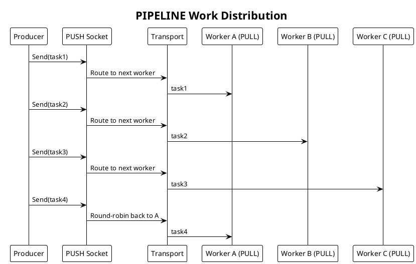
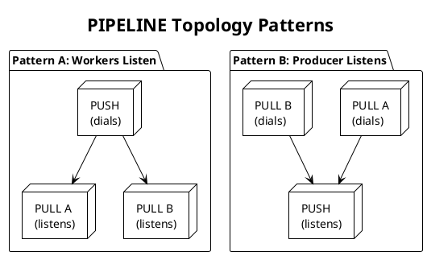
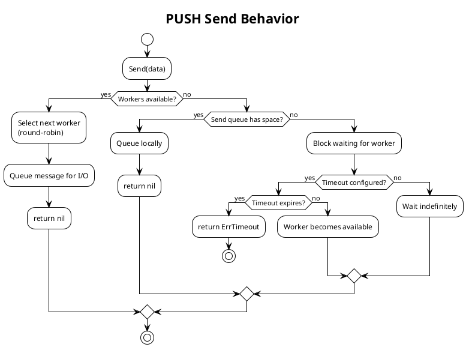

# PRD: PIPELINE Protocol Engine (PUSH/PULL)

Issue: sp-4qz.6
Status: Draft
Author: Claude
Date: 2026-01-28

## Overview

The PIPELINE protocol (also called PUSH/PULL) implements work distribution across multiple workers. A PUSH socket distributes tasks to connected PULL sockets using round-robin load balancing. Each message reaches exactly one worker, enabling parallel processing of independent tasks.

PIPELINE provides flow control through back-pressure. When no workers are available, the pusher blocks until one becomes ready. This differs from PUB/SUB where messages are dropped for slow subscribers.



## Requirements

Table: Functional Requirements

| ID | Requirement |
|----|-------------|
| PL-1 | PUSH socket sends messages to exactly one connected PULL socket |
| PL-2 | PULL socket receives messages from connected PUSH sockets |
| PL-3 | Messages are load-balanced across PULL sockets using round-robin |
| PL-4 | Back-pressure: PUSH blocks when all workers are busy |
| PL-5 | PUSH socket is send-only; Recv() returns error |
| PL-6 | PULL socket is receive-only; Send() returns error |
| PL-7 | Worker disconnection redistributes load to remaining workers |
| PL-8 | Optional send queue buffers messages before blocking |

Table: Non-Functional Requirements

| ID | Requirement |
|----|-------------|
| NF-1 | Task dispatch latency below 15μs on local Unix transport |
| NF-2 | Zero-copy message path where possible |
| NF-3 | Load balancing selection completes in O(1) |
| NF-4 | All socket operations are goroutine-safe |
| NF-5 | Clean shutdown with no goroutine leaks, pending tasks drained |

## Design

### Protocol Characteristics

PIPELINE differs from PUB/SUB and REQ/REP in several ways:

Table: Protocol Comparison

| Aspect | PUB/SUB | PIPELINE | REQ/REP |
|--------|---------|----------|---------|
| Topology | 1:N fan-out | N:M distribution | N:1 request-reply |
| Delivery | All subscribers | Exactly one worker | One replier |
| Back-pressure | None (drop) | Yes (blocks) | Yes (blocks) |
| Direction | Unidirectional | Unidirectional | Bidirectional |
| State Machine | No | No | Yes |

### PUSH Socket Implementation

The PUSH socket distributes messages to workers using round-robin selection.

```go
// PushSocket distributes work to connected workers.
type PushSocket struct {
    // Base socket functionality
    base    *BaseSocket

    // Peer management
    peers   *PeerRegistry
    peerIdx atomic.Uint32  // Round-robin index

    // Send queue (optional buffering)
    sendQueue chan *Message

    // Channels
    sendCh chan<- *Message  // To I/O workers
}

// NewPushSocket creates a PUSH socket.
func NewPushSocket(cfg PushConfig) (*PushSocket, error)

// Send sends a task to one connected worker.
// Blocks if no worker is available and send queue is full.
// Returns ErrClosed if socket is closed.
// Returns ErrTimeout if send timeout expires.
func (s *PushSocket) Send(data []byte) error

// SendTimeout sends with a timeout.
// Returns ErrTimeout if no worker becomes available in time.
func (s *PushSocket) SendTimeout(data []byte, timeout time.Duration) error

// Recv is not supported on PUSH sockets.
// Always returns ErrNotSupported.
func (s *PushSocket) Recv() ([]byte, error)

// Close closes the socket and releases resources.
// Pending sends may be drained or canceled based on configuration.
func (s *PushSocket) Close() error
```

We implement round-robin distribution:

```go
func (s *PushSocket) Send(data []byte) error {
    msg := s.base.pool.NewMessage(data)

    for {
        peer, err := s.selectPeer()
        if err == ErrNoPeers {
            // No workers available, wait for one
            select {
            case <-s.peers.Available():
                continue  // Retry peer selection
            case <-s.base.ctx.Done():
                msg.Release()
                return ErrClosed
            }
        }
        if err != nil {
            msg.Release()
            return err
        }

        msg.PeerID = peer

        select {
        case s.sendCh <- msg:
            return nil
        case <-s.base.ctx.Done():
            msg.Release()
            return ErrClosed
        }
    }
}

// selectPeer returns the next peer in round-robin order.
func (s *PushSocket) selectPeer() (PeerID, error) {
    peers := s.peers.Ready()  // Only peers ready to receive
    if len(peers) == 0 {
        return 0, ErrNoPeers
    }

    idx := s.peerIdx.Add(1) % uint32(len(peers))
    return peers[idx].ID, nil
}
```

### PULL Socket Implementation

The PULL socket receives tasks from connected pushers.

```go
// PullSocket receives work from pushers.
type PullSocket struct {
    // Base socket functionality
    base   *BaseSocket

    // Channels
    recvCh <-chan *Message  // From I/O workers
}

// NewPullSocket creates a PULL socket.
func NewPullSocket(cfg PullConfig) (*PullSocket, error)

// Recv receives the next task.
// Blocks until a task arrives.
// Returns ErrClosed if socket is closed.
func (s *PullSocket) Recv() ([]byte, error)

// RecvTimeout receives with a timeout.
// Returns ErrTimeout if no task arrives in time.
func (s *PullSocket) RecvTimeout(timeout time.Duration) ([]byte, error)

// Send is not supported on PULL sockets.
// Always returns ErrNotSupported.
func (s *PullSocket) Send(data []byte) error

// Close closes the socket and releases resources.
func (s *PullSocket) Close() error
```

The PULL implementation is straightforward:

```go
func (s *PullSocket) Recv() ([]byte, error) {
    select {
    case msg := <-s.recvCh:
        data := make([]byte, len(msg.Data))
        copy(data, msg.Data)
        msg.Release()
        return data, nil

    case <-s.base.ctx.Done():
        return nil, ErrClosed
    }
}

func (s *PullSocket) RecvTimeout(timeout time.Duration) ([]byte, error) {
    timer := time.NewTimer(timeout)
    defer timer.Stop()

    select {
    case msg := <-s.recvCh:
        data := make([]byte, len(msg.Data))
        copy(data, msg.Data)
        msg.Release()
        return data, nil

    case <-timer.C:
        return nil, ErrTimeout

    case <-s.base.ctx.Done():
        return nil, ErrClosed
    }
}
```

### Configuration

```go
// PushConfig holds PUSH socket configuration.
type PushConfig struct {
    // SendQueueSize is the local queue size before blocking.
    // When queue is full and no worker ready, Send blocks.
    // Default: 0 (unbuffered, immediate back-pressure).
    SendQueueSize int

    // SendTimeout is the maximum time to wait for a worker.
    // Default: 0 (no timeout, block indefinitely).
    SendTimeout time.Duration
}

// PullConfig holds PULL socket configuration.
type PullConfig struct {
    // RecvQueueSize is the receive buffer size.
    // Default: 128.
    RecvQueueSize int

    // RecvTimeout is the maximum time to wait for a task.
    // Default: 0 (no timeout, block indefinitely).
    RecvTimeout time.Duration
}
```

### Topology Patterns

PIPELINE supports two common topologies:

Table: Topology Patterns

| Pattern | PUSH Role | PULL Role | Use Case |
|---------|-----------|-----------|----------|
| Workers Listen | Dials to each worker | Listens on known address | Static worker pool |
| Producer Listens | Listens on one address | Dials to producer | Dynamic workers, discovery |



### Error Types

```go
var (
    // ErrNotSupported indicates operation not available on this socket type.
    ErrNotSupported = errors.New("protocol: operation not supported")

    // ErrNoPeers indicates no connected peers available.
    ErrNoPeers = errors.New("protocol: no peers")

    // ErrTimeout indicates the operation timed out.
    ErrTimeout = errors.New("protocol: timeout")

    // ErrClosed indicates the socket has been closed.
    ErrClosed = errors.New("protocol: closed")
)
```

### Back-pressure Behavior

PIPELINE provides flow control through blocking:



## Testing Strategy

Table: Unit Tests

| Test | Description |
|------|-------------|
| TestPushSendSingleWorker | Send to one connected worker |
| TestPushRoundRobin | Round-robin across multiple workers |
| TestPushNoWorkers | Send blocks when no workers connected |
| TestPushTimeout | Send returns ErrTimeout after deadline |
| TestPushWorkerDisconnect | Load redistributes on worker failure |
| TestPullRecv | Receive from pusher |
| TestPullRecvTimeout | Timeout when no tasks available |
| TestPushRecvError | Recv on PUSH returns ErrNotSupported |
| TestPullSendError | Send on PULL returns ErrNotSupported |
| TestSocketClose | Clean shutdown, pending ops handled |

Table: Integration Tests

| Test | Description |
|------|-------------|
| TestPipelineBasic | Full push-pull with transport |
| TestPipelineMultipleWorkers | Fan-out to many workers |
| TestPipelineLoadBalance | Verify even distribution |
| TestPipelineBackpressure | Blocking under load |
| TestPipelineUnixTransport | PUSH/PULL over Unix sockets |
| TestPipelineIPTransport | PUSH/PULL over IP sockets |

Table: Benchmarks

| Benchmark | Target |
|-----------|--------|
| BenchmarkPushPullLatency | < 15μs round-trip (Unix) |
| BenchmarkPushThroughput | > 100K tasks/sec |
| BenchmarkPushFanout10 | < 200μs for 10 workers |
| BenchmarkPullThroughput | > 100K tasks/sec |

## Acceptance Criteria

We consider this PRD complete when:

1. PUSH Socket implements Send with round-robin distribution
2. PULL Socket implements Recv for task reception
3. Back-pressure blocks PUSH when no workers available
4. Round-robin distributes load evenly across workers
5. Worker disconnection updates load balancing
6. Optional send queue buffers tasks before blocking
7. PUSH.Recv and PULL.Send return ErrNotSupported
8. Clean shutdown with no goroutine leaks
9. Benchmarks meet latency and throughput targets
10. GoDoc comments exist on all exported types and methods

## Dependencies

We depend on the Transport Abstraction Layer, Shared Infrastructure (BufferPool, PeerRegistry), and I/O Workers.

## References

- [NNG PIPELINE Documentation](https://nng.nanomsg.org/man/tip/nng_push.7.html)
- SP ARCHITECTURE.md, Protocol Engine section
- BACKGROUND/nng/nng-push-pull.md
