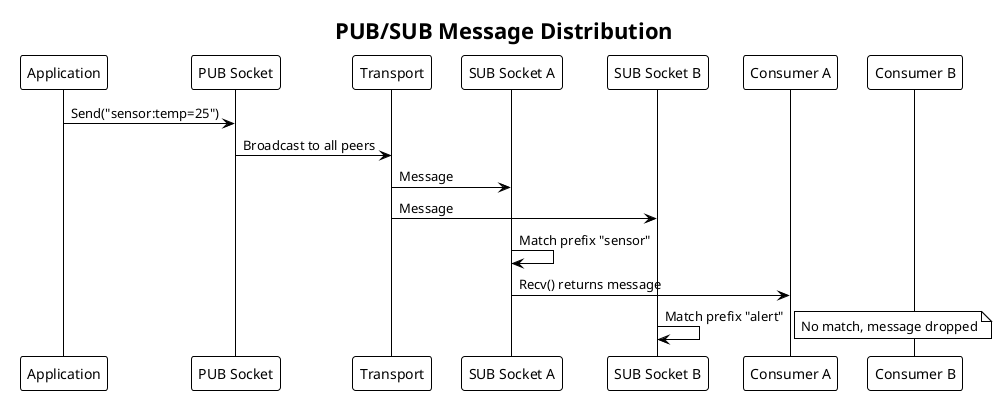

# PRD: PUB/SUB Protocol Engine

Issue: sp-4qz.5
Status: Draft
Author: Claude
Date: 2026-01-28

## Overview

The PUB/SUB protocol implements one-to-many message distribution. A PUB (publisher) socket broadcasts messages to all connected SUB (subscriber) sockets. Subscribers filter messages locally using byte-prefix matching. We use this pattern for event distribution, notification systems, and data streaming where multiple consumers need the same information.

PUB/SUB uses fire-and-forget semantics with no delivery guarantees. Publishers do not track subscribers or wait for acknowledgments. Subscribers that connect late or disconnect temporarily will miss messages.



## Requirements

Table: Functional Requirements

| ID | Requirement |
|----|-------------|
| PS-1 | PUB socket broadcasts messages to all connected subscribers |
| PS-2 | SUB socket receives messages matching subscribed topic prefixes |
| PS-3 | Topic matching uses byte-prefix comparison (binary-safe) |
| PS-4 | Subscribers can subscribe to multiple topic prefixes |
| PS-5 | Empty subscription (zero-length prefix) receives all messages |
| PS-6 | Subscribers can add and remove subscriptions dynamically |
| PS-7 | PUB socket is send-only; Recv() returns error |
| PS-8 | SUB socket is receive-only; Send() returns error |

Table: Non-Functional Requirements

| ID | Requirement |
|----|-------------|
| NF-1 | Broadcast latency below 10μs per subscriber on local Unix transport |
| NF-2 | Zero-copy message path where possible |
| NF-3 | Prefix matching completes in O(n) where n is subscription count |
| NF-4 | All socket operations are goroutine-safe |
| NF-5 | Clean shutdown with no goroutine leaks |

## Design

### Protocol Characteristics

PUB/SUB differs from REQ/REP in several ways:

Table: Protocol Comparison

| Aspect | REQ/REP | PUB/SUB |
|--------|---------|---------|
| Topology | N:1 (many requesters to one replier) | 1:N (one publisher to many subscribers) |
| Direction | Bidirectional (request then reply) | Unidirectional (publisher to subscribers) |
| State Machine | Yes (send/recv ordering enforced) | No (stateless, always ready) |
| Delivery | Correlated (replies match requests) | Fire-and-forget (no acknowledgment) |
| Filtering | None | Subscriber-side prefix matching |

### PUB Socket Implementation

The PUB socket broadcasts messages to all connected peers. It maintains no protocol state beyond the peer list.

```go
// PubSocket broadcasts messages to all subscribers.
type PubSocket struct {
    // Base socket functionality
    base   *BaseSocket

    // Peer management
    peers  *PeerRegistry

    // Channels
    sendCh chan<- *Message  // To I/O workers
}

// NewPubSocket creates a PUB socket.
func NewPubSocket(cfg SocketConfig) (*PubSocket, error)

// Send broadcasts a message to all connected subscribers.
// The message body should start with a topic prefix for filtering.
// Returns ErrClosed if socket is closed.
// Never blocks on slow subscribers (fire-and-forget).
func (s *PubSocket) Send(data []byte) error

// Recv is not supported on PUB sockets.
// Always returns ErrNotSupported.
func (s *PubSocket) Recv() ([]byte, error)

// Close closes the socket and releases resources.
func (s *PubSocket) Close() error
```

We implement the broadcast as follows:

```go
func (s *PubSocket) Send(data []byte) error {
    peers := s.peers.All()
    if len(peers) == 0 {
        // No subscribers, message is dropped silently
        return nil
    }

    // Create message from pool
    msg := s.base.pool.NewMessage(data)

    // Broadcast to all peers
    for _, peer := range peers {
        // Clone message for each peer
        clone := msg.Clone()
        clone.PeerID = peer.ID

        select {
        case s.sendCh <- clone:
            // Queued for sending
        default:
            // Slow subscriber, drop message for this peer
            clone.Release()
        }
    }

    msg.Release()
    return nil
}
```

### SUB Socket Implementation

The SUB socket receives messages and filters them against subscribed topic prefixes.

```go
// SubSocket receives messages from publishers with topic filtering.
type SubSocket struct {
    // Base socket functionality
    base   *BaseSocket

    // Subscription management
    subsMu sync.RWMutex
    subs   [][]byte  // Topic prefixes (byte slices for binary safety)

    // Channels
    recvCh   <-chan *Message  // From I/O workers
    filtered chan *Message    // After topic filtering
}

// NewSubSocket creates a SUB socket.
func NewSubSocket(cfg SocketConfig) (*SubSocket, error)

// Subscribe adds a topic prefix subscription.
// Messages whose body starts with this prefix will be delivered.
// An empty prefix subscribes to all messages.
func (s *SubSocket) Subscribe(topic []byte) error

// Unsubscribe removes a topic subscription.
// Returns ErrNotFound if subscription does not exist.
func (s *SubSocket) Unsubscribe(topic []byte) error

// Recv receives the next message matching subscriptions.
// Blocks until a matching message arrives.
// Returns ErrClosed if socket is closed.
func (s *SubSocket) Recv() ([]byte, error)

// Send is not supported on SUB sockets.
// Always returns ErrNotSupported.
func (s *SubSocket) Send(data []byte) error

// Close closes the socket and releases resources.
func (s *SubSocket) Close() error
```

We implement topic filtering in the SUB protocol goroutine:

```go
func (s *SubSocket) run(ctx context.Context) {
    defer s.cleanup()

    for {
        select {
        case <-ctx.Done():
            return

        case msg := <-s.recvCh:
            if s.matches(msg.Data) {
                select {
                case s.filtered <- msg:
                    // Delivered to application
                default:
                    // Application not receiving, drop message
                    msg.Release()
                }
            } else {
                // No subscription match, drop message
                msg.Release()
            }
        }
    }
}

// matches checks if message body matches any subscription prefix.
func (s *SubSocket) matches(body []byte) bool {
    s.subsMu.RLock()
    defer s.subsMu.RUnlock()

    for _, prefix := range s.subs {
        // Empty prefix matches all messages
        if len(prefix) == 0 {
            return true
        }
        // Check if body starts with prefix
        if len(body) >= len(prefix) && bytes.Equal(body[:len(prefix)], prefix) {
            return true
        }
    }
    return false
}

func (s *SubSocket) Recv() ([]byte, error) {
    select {
    case msg := <-s.filtered:
        data := make([]byte, len(msg.Data))
        copy(data, msg.Data)
        msg.Release()
        return data, nil

    case <-s.base.ctx.Done():
        return nil, ErrClosed
    }
}
```

### Subscription Management

```go
func (s *SubSocket) Subscribe(topic []byte) error {
    s.subsMu.Lock()
    defer s.subsMu.Unlock()

    // Check for duplicate subscription
    for _, existing := range s.subs {
        if bytes.Equal(existing, topic) {
            return nil  // Already subscribed
        }
    }

    // Add new subscription (copy the slice)
    prefix := make([]byte, len(topic))
    copy(prefix, topic)
    s.subs = append(s.subs, prefix)
    return nil
}

func (s *SubSocket) Unsubscribe(topic []byte) error {
    s.subsMu.Lock()
    defer s.subsMu.Unlock()

    for i, existing := range s.subs {
        if bytes.Equal(existing, topic) {
            // Remove subscription (order not preserved)
            s.subs[i] = s.subs[len(s.subs)-1]
            s.subs = s.subs[:len(s.subs)-1]
            return nil
        }
    }
    return ErrNotFound
}
```

### Error Types

```go
var (
    // ErrNotSupported indicates operation not available on this socket type.
    ErrNotSupported = errors.New("protocol: operation not supported")

    // ErrNotFound indicates the requested item was not found.
    ErrNotFound = errors.New("protocol: not found")

    // ErrClosed indicates the socket has been closed.
    ErrClosed = errors.New("protocol: closed")
)
```

### Configuration

```go
// PubConfig holds PUB socket configuration.
type PubConfig struct {
    // SendQueueSize is the per-peer send queue size.
    // Messages dropped when queue full (no backpressure).
    // Default: 16.
    SendQueueSize int
}

// SubConfig holds SUB socket configuration.
type SubConfig struct {
    // RecvQueueSize is the receive buffer size for filtered messages.
    // Default: 128.
    RecvQueueSize int

    // DropPolicy determines behavior when receive queue is full.
    // If true (default), drop oldest messages.
    // If false, drop new messages.
    DropOldest bool
}
```

### Topic Conventions

We recommend the following topic prefix conventions:

Table: Topic Prefix Conventions

| Pattern | Example | Use Case |
|---------|---------|----------|
| Category prefix | `sensor:` | Group related messages |
| Hierarchical | `sensor/temperature/` | Nested categories |
| Binary prefix | `0x01 0x02` | Binary protocols |
| Empty | `` | Subscribe to all messages |

Applications encode the topic at the start of the message body. The subscriber receives the complete message including the topic prefix.

```go
// Publisher
pub.Send([]byte("sensor:temp=25"))
pub.Send([]byte("alert:high"))

// Subscriber
sub.Subscribe([]byte("sensor"))
msg, _ := sub.Recv()  // Returns "sensor:temp=25"
```

## Testing Strategy

Table: Unit Tests

| Test | Description |
|------|-------------|
| TestPubSendNoSubscribers | Send with no subscribers returns nil (silent drop) |
| TestPubBroadcast | Message delivered to all connected subscribers |
| TestSubFilterMatch | Matching prefix delivers message |
| TestSubFilterNoMatch | Non-matching prefix drops message |
| TestSubEmptyPrefix | Empty subscription receives all messages |
| TestSubMultiplePrefixes | Multiple subscriptions work correctly |
| TestSubSubscribeUnsubscribe | Dynamic subscription management |
| TestPubRecvError | Recv on PUB returns ErrNotSupported |
| TestSubSendError | Send on SUB returns ErrNotSupported |
| TestSocketClose | Clean shutdown, pending ops canceled |

Table: Integration Tests

| Test | Description |
|------|-------------|
| TestPubSubBasic | Full publish-subscribe with transport |
| TestPubSubMultipleSubscribers | Fan-out to many subscribers |
| TestPubSubTopicFiltering | Different subscribers, different topics |
| TestPubSubLateSubscriber | Late subscriber misses earlier messages |
| TestPubSubUnixTransport | PUB/SUB over Unix sockets |
| TestPubSubIPTransport | PUB/SUB over IP sockets |

Table: Benchmarks

| Benchmark | Target |
|-----------|--------|
| BenchmarkPubFanout10 | < 100μs for 10 subscribers (Unix) |
| BenchmarkPubFanout100 | < 1ms for 100 subscribers (Unix) |
| BenchmarkSubFiltering | < 1μs per prefix check |
| BenchmarkSubThroughput | > 100K messages/sec |

## Acceptance Criteria

We consider this PRD complete when:

1. PUB Socket implements Send with broadcast to all peers
2. SUB Socket implements Recv with topic prefix filtering
3. Subscribe and Unsubscribe manage subscriptions dynamically
4. Empty subscription receives all messages
5. Non-matching messages are silently dropped
6. PUB.Recv and SUB.Send return ErrNotSupported
7. Clean shutdown with no goroutine leaks
8. Benchmarks meet latency and throughput targets
9. GoDoc comments exist on all exported types and methods

## Dependencies

We depend on the Transport Abstraction Layer, Shared Infrastructure (BufferPool, PeerRegistry), and I/O Workers.

## References

- [NNG PUB/SUB Documentation](https://nng.nanomsg.org/man/tip/nng_pub.7.html)
- SP ARCHITECTURE.md, Protocol Engine section
- BACKGROUND/nng/nng-pub-sub.md
