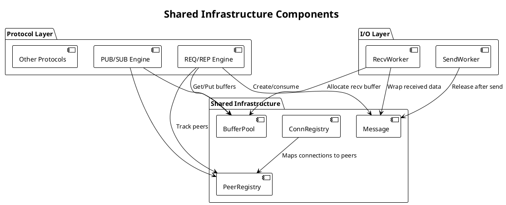
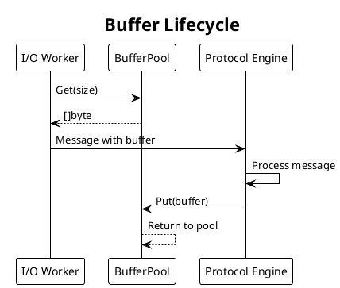

# PRD: Shared Infrastructure

Issue: sp-ms6.7
Status: Draft
Author: Claude
Date: 2026-01-27

## Overview

The Shared Infrastructure layer provides common components used across all protocol implementations. We provide buffer pooling for zero-allocation messaging, peer tracking for connection management, and a connection registry for socket state. These components enforce consistency and enable the performance guarantees SP requires.



## Requirements

Table: Functional Requirements

| ID | Requirement |
|----|-------------|
| SI-1 | Message Buffer Pool provides reusable byte slices for message payloads |
| SI-2 | Peer Registry tracks connected peers and their protocol-specific state |
| SI-3 | Connection Registry maps transport connections to socket instances |
| SI-4 | All registries support concurrent access from multiple goroutines |
| SI-5 | Resources release deterministically when sockets close |
| SI-6 | Pool statistics available for monitoring and tuning |

Table: Non-Functional Requirements

| ID | Requirement |
|----|-------------|
| NF-1 | Buffer acquisition below 50ns when pool has available buffers |
| NF-2 | Zero allocations in steady-state send/recv operations |
| NF-3 | Registry lookups complete in O(1) average case |
| NF-4 | All operations are goroutine-safe |
| NF-5 | Pool does not grow unboundedly under load |

## Design

### Message Buffer Pool

The buffer pool provides preallocated byte slices sized for typical message payloads. We eliminate per-message allocation overhead in the hot path.

```go
// BufferPool manages a pool of reusable byte buffers.
type BufferPool struct {
    pool      sync.Pool
    size      int           // Default buffer size
    maxSize   int           // Maximum buffer size (larger requests allocate)

    // Statistics (atomic)
    gets      atomic.Uint64 // Total Get() calls
    puts      atomic.Uint64 // Total Put() calls
    news      atomic.Uint64 // Allocations (pool miss)
    oversized atomic.Uint64 // Requests exceeding maxSize
}

// Get returns a buffer of at least the requested size.
// The returned buffer may be larger than requested.
// Callers must call Put() when done with the buffer.
func (p *BufferPool) Get(size int) []byte

// Put returns a buffer to the pool for reuse.
// Buffers larger than maxSize are discarded.
// Passing nil is safe and is a no-op.
func (p *BufferPool) Put(buf []byte)

// Stats returns current pool statistics.
func (p *BufferPool) Stats() BufferPoolStats

// BufferPoolStats holds pool performance metrics.
type BufferPoolStats struct {
    Gets      uint64  // Total Get() calls
    Puts      uint64  // Total Put() calls
    News      uint64  // Allocations (pool misses)
    Oversized uint64  // Requests exceeding maxSize
    HitRate   float64 // (Gets - News) / Gets
}
```

Table: Buffer Pool Design Decisions

| Decision | Rationale |
|----------|-----------|
| sync.Pool underlying storage | Leverages Go's GC-aware pooling; buffers may be reclaimed under memory pressure |
| Single size class (64KB) | Matches transport max message size; larger requests allocate directly |
| No explicit capacity limit | sync.Pool manages size based on GC pressure, bounding memory automatically |
| Atomic statistics counters | Track pool effectiveness without adding lock contention |

### Buffer Lifecycle



### Peer Registry

The Peer Registry tracks all connected peers for a socket, storing protocol-specific state for each connection.

```go
// PeerRegistry manages connected peers for a socket.
type PeerRegistry struct {
    mu    sync.RWMutex
    peers map[PeerID]*Peer

    // Index by address for fast reverse lookup
    byAddr map[string]PeerID
}

// PeerID uniquely identifies a peer within a socket.
type PeerID uint64

// Peer represents a connected remote endpoint.
type Peer struct {
    ID        PeerID
    Addr      transport.Addr
    State     PeerState

    // Protocol-specific state (set by protocol engine)
    Proto     any  // e.g., *ReqState, *SubState

    // Statistics
    MsgsSent  atomic.Uint64
    MsgsRecv  atomic.Uint64
    BytesSent atomic.Uint64
    BytesRecv atomic.Uint64

    // Lifecycle
    Connected time.Time
    LastSeen  time.Time
}

// PeerState represents the connection state of a peer.
type PeerState int

const (
    PeerConnecting PeerState = iota
    PeerConnected
    PeerDisconnecting
    PeerDisconnected
)

// Add registers a new peer, returning its assigned ID.
func (r *PeerRegistry) Add(addr transport.Addr) (PeerID, *Peer)

// Remove unregisters a peer by ID.
func (r *PeerRegistry) Remove(id PeerID) bool

// Get retrieves a peer by ID. Returns nil if not found.
func (r *PeerRegistry) Get(id PeerID) *Peer

// GetByAddr retrieves a peer by address. Returns nil if not found.
func (r *PeerRegistry) GetByAddr(addr transport.Addr) *Peer

// All returns all connected peers (snapshot).
func (r *PeerRegistry) All() []*Peer

// Count returns the number of registered peers.
func (r *PeerRegistry) Count() int

// Range iterates over all peers. Return false to stop iteration.
func (r *PeerRegistry) Range(fn func(id PeerID, peer *Peer) bool)
```

Table: Peer Registry Design Decisions

| Decision | Rationale |
|----------|-----------|
| RWMutex for access | Protocol engines read peer state frequently; writes occur less often |
| Dual indexing (ID + address) | ID for internal routing, address for transport-level lookups |
| Generic Proto field | Protocol engines store pattern-specific state without registry changes |
| Atomic statistics | Per-peer metrics update without lock contention |
| Snapshot semantics for All() | Returns a copy to prevent iteration races |

### Connection Registry

The Connection Registry maps transport connections to their owning sockets, enabling connection lifecycle management.

```go
// ConnRegistry maps connections to sockets.
type ConnRegistry struct {
    mu    sync.RWMutex
    conns map[ConnID]*ConnEntry
}

// ConnID uniquely identifies a connection (file descriptor or handle).
type ConnID uint64

// ConnEntry holds connection metadata.
type ConnEntry struct {
    ID        ConnID
    Transport transport.Transport
    Socket    *Socket  // Owning socket
    PeerID    PeerID   // Associated peer in socket's PeerRegistry

    // Channels for I/O worker communication
    SendCh    chan<- *Message
    RecvCh    <-chan *Message

    // Lifecycle
    Created   time.Time
    Closed    atomic.Bool
}

// Register adds a connection to the registry.
func (r *ConnRegistry) Register(t transport.Transport, sock *Socket) (*ConnEntry, error)

// Unregister removes a connection from the registry.
func (r *ConnRegistry) Unregister(id ConnID) bool

// Get retrieves a connection entry by ID.
func (r *ConnRegistry) Get(id ConnID) *ConnEntry

// GetBySocket returns all connections for a socket.
func (r *ConnRegistry) GetBySocket(sock *Socket) []*ConnEntry

// CloseAll closes all connections for a socket.
func (r *ConnRegistry) CloseAll(sock *Socket) error
```

Table: Connection Registry Design Decisions

| Decision | Rationale |
|----------|-----------|
| Central connection tracking | Enables socket to find all its connections for cleanup |
| Channel references in entry | Holds channels for I/O worker communication, established at registration |
| Back-reference to socket | Allows transport-level events to route to correct socket |
| Atomic closed flag | Fast check without lock for hot-path operations |

### Message Type

Messages flow between layers with routing metadata preserved.

```go
// Message represents a protocol message with routing information.
type Message struct {
    // Payload data (from BufferPool)
    Data   []byte

    // Routing information
    Addr   transport.Addr  // Source (recv) or destination (send)
    PeerID PeerID          // Internal peer identifier

    // Protocol header (pattern-specific)
    Header []byte

    // Pool reference for returning buffer
    pool   *BufferPool
}

// Release returns the message buffer to the pool.
// Must be called when message processing is complete.
func (m *Message) Release()

// Clone creates a copy of the message with its own buffer.
// Used when message must outlive the receive buffer.
func (m *Message) Clone() *Message
```

### Synchronization Patterns

Table: Synchronization Strategy

| Component | Lock Type | Rationale |
|-----------|-----------|-----------|
| BufferPool | sync.Pool (lock-free) | High contention, GC-integrated |
| PeerRegistry | sync.RWMutex | Read-heavy, infrequent writes |
| ConnRegistry | sync.RWMutex | Read-heavy, infrequent writes |
| Peer.Stats | atomic.Uint64 | Per-operation updates, no coordination needed |
| Message | None (ownership transfer) | Single owner at any time |

### Configuration

```go
// InfraConfig holds shared infrastructure configuration.
type InfraConfig struct {
    // Buffer pool settings
    BufferSize    int  // Default buffer size (default: 65536)
    MaxBufferSize int  // Max pooled buffer size (default: 65536)

    // Registry settings
    InitialPeerCapacity int  // Initial peer map capacity (default: 16)
    InitialConnCapacity int  // Initial conn map capacity (default: 16)
}

// DefaultInfraConfig returns sensible defaults.
func DefaultInfraConfig() InfraConfig
```

## Testing Strategy

Table: Unit Tests

| Test | Description |
|------|-------------|
| TestBufferPoolGetPut | Basic get/put operations |
| TestBufferPoolConcurrent | Concurrent access from multiple goroutines |
| TestBufferPoolOversized | Large buffer requests handled correctly |
| TestBufferPoolStats | Statistics accurately track operations |
| TestPeerRegistryAdd | Adding peers assigns unique IDs |
| TestPeerRegistryRemove | Removing peers cleans up correctly |
| TestPeerRegistryLookup | Lookup by ID and address works |
| TestPeerRegistryConcurrent | Concurrent add/remove/lookup |
| TestConnRegistryLifecycle | Register/unregister flow |
| TestConnRegistryCloseAll | Socket close cleans up connections |
| TestMessageRelease | Buffer returned to pool on release |

Table: Benchmarks

| Benchmark | Target |
|-----------|--------|
| BenchmarkBufferPoolGet | < 50ns per operation |
| BenchmarkBufferPoolConcurrent | Linear scaling to 8 goroutines |
| BenchmarkPeerRegistryLookup | < 100ns per lookup |
| BenchmarkPeerRegistryAdd | < 500ns per add |
| BenchmarkMessageClone | < 1μs for 1KB message |

## Acceptance Criteria

We consider this PRD complete when:

1. BufferPool implements Get/Put operations with sync.Pool backend
2. PeerRegistry provides full CRUD with dual indexing
3. ConnRegistry manages connection lifecycle
4. Message type includes Release() for buffer return
5. All operations are goroutine-safe, verified by race detector
6. Steady-state operations allocate no memory
7. Benchmarks meet performance targets
8. GoDoc comments exist on all exported types and methods

## Dependencies

We depend on the Transport Abstraction Layer (sp-ms6.1) for the Addr type. We use only the Go standard library: sync, sync/atomic, and time packages.

## References

- SP ARCHITECTURE.md, Shared Components section
- [sync.Pool documentation](https://pkg.go.dev/sync#Pool)
- [Go Race Detector](https://go.dev/doc/articles/race_detector)
