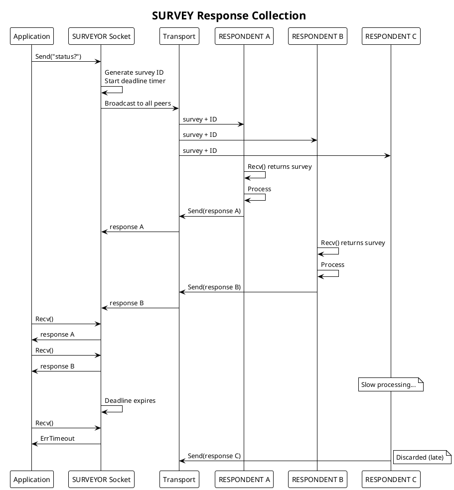
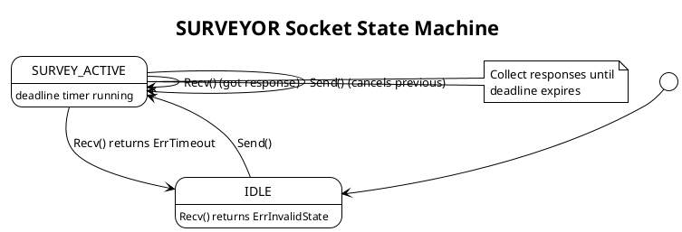
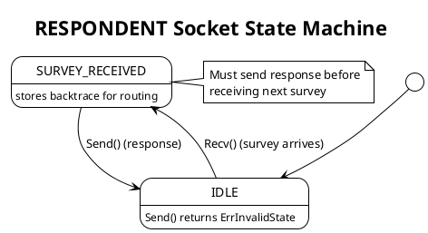

# PRD: SURVEY Protocol Engine (SURVEYOR/RESPONDENT)

Issue: sp-4qz.7
Status: Draft
Author: Claude
Date: 2026-01-28

## Overview

The SURVEY protocol implements broadcast query with response collection. A SURVEYOR socket broadcasts a query to all connected RESPONDENT sockets and collects replies within a configurable deadline. We use this pattern for service discovery, health checks, voting systems, and scenarios requiring responses from multiple peers.

Unlike REQ/REP where one requester talks to one replier, SURVEY broadcasts to all respondents and expects multiple replies. The survey is a timed event—responses arriving after the deadline are discarded.



## Requirements

Table: Functional Requirements

| ID | Requirement |
|----|-------------|
| SV-1 | SURVEYOR socket broadcasts survey to all connected respondents |
| SV-2 | RESPONDENT socket receives surveys and sends responses |
| SV-3 | Survey ID correlates responses to the originating survey |
| SV-4 | SURVEYOR collects responses within configurable deadline |
| SV-5 | Recv returns ErrTimeout when deadline expires |
| SV-6 | Recv returns ErrInvalidState if no survey is active |
| SV-7 | New survey cancels any pending survey |
| SV-8 | Late responses are discarded silently |
| SV-9 | RESPONDENT stores backtrace header for response routing |

Table: Non-Functional Requirements

| ID | Requirement |
|----|-------------|
| NF-1 | Survey broadcast latency below 10μs per respondent on local Unix transport |
| NF-2 | Zero-copy message path where possible |
| NF-3 | Survey ID matching completes in O(1) |
| NF-4 | All socket operations are goroutine-safe |
| NF-5 | Clean shutdown with no goroutine leaks |

## Design

### Protocol State Machines

The SURVEYOR socket enforces state transitions for survey lifecycle.





### Survey ID Header Format

We use the same backtrace header format as REQ/REP:

```
┌────────────────┬────────────────┬────────────────┐
│  Peer ID (opt) │  Peer ID (opt) │   Survey ID    │
│  MSB=0         │  MSB=0         │   MSB=1        │
│  4 bytes BE    │  4 bytes BE    │  4 bytes BE    │
└────────────────┴────────────────┴────────────────┘
```

Table: Header Components

| Component | Value Range | Purpose |
|-----------|-------------|---------|
| Survey ID | 0x80000000 - 0xFFFFFFFF | Generated by SURVEYOR, MSB always set |
| Peer IDs | 0x00000000 - 0x7FFFFFFF | For forwarding devices, MSB clear |

### SURVEYOR Socket Implementation

```go
// SurveyorSocket sends surveys and collects responses.
type SurveyorSocket struct {
    // Base socket functionality
    base     *BaseSocket

    // Protocol state
    state    atomic.Uint32   // SurveyorState enum
    mu       sync.Mutex      // Protects state transitions

    // Current survey tracking
    surveyID   atomic.Uint32   // Current survey ID counter
    pending    *pendingSurvey  // Active survey state

    // Peer management
    peers    *PeerRegistry

    // Configuration
    deadline time.Duration  // Survey collection window

    // Channels
    recvCh   <-chan *Message  // From I/O workers
    sendCh   chan<- *Message  // To I/O workers
}

// SurveyorState represents SURVEYOR socket state.
type SurveyorState uint32

const (
    SurveyorStateIdle SurveyorState = iota
    SurveyorStateSurveyActive
)

// pendingSurvey tracks an active survey.
type pendingSurvey struct {
    id         uint32
    startedAt  time.Time
    deadline   time.Time
    responses  chan *Message  // Buffered channel for responses
    cancel     context.CancelFunc
}

// NewSurveyorSocket creates a SURVEYOR socket.
func NewSurveyorSocket(cfg SurveyorConfig) (*SurveyorSocket, error)

// Send broadcasts a survey to all connected respondents.
// Starts the deadline timer for response collection.
// Cancels any previous pending survey.
func (s *SurveyorSocket) Send(data []byte) error

// Recv receives the next response to the active survey.
// Blocks until a response arrives or the deadline expires.
// Returns ErrTimeout when the deadline expires.
// Returns ErrInvalidState if no survey is active.
func (s *SurveyorSocket) Recv() ([]byte, error)

// SetDeadline sets the survey collection deadline.
// Must be called before Send.
func (s *SurveyorSocket) SetDeadline(d time.Duration)

// Close closes the socket and releases resources.
func (s *SurveyorSocket) Close() error
```

We implement the SURVEYOR protocol goroutine as follows:

```go
func (s *SurveyorSocket) run(ctx context.Context) {
    defer s.cleanup()

    for {
        select {
        case <-ctx.Done():
            return

        case msg := <-s.recvCh:
            s.mu.Lock()
            if s.pending != nil {
                // Check if response matches current survey
                surveyID, err := DecodeRequestID(msg.Header)
                if err == nil && surveyID == s.pending.id {
                    // Check if still within deadline
                    if time.Now().Before(s.pending.deadline) {
                        select {
                        case s.pending.responses <- msg:
                            // Delivered to application
                        default:
                            // Response buffer full, drop
                            msg.Release()
                        }
                    } else {
                        // Late response, discard
                        msg.Release()
                    }
                } else {
                    // Wrong survey ID, discard
                    msg.Release()
                }
            } else {
                // No active survey, discard
                msg.Release()
            }
            s.mu.Unlock()
        }
    }
}

func (s *SurveyorSocket) Send(data []byte) error {
    s.mu.Lock()
    defer s.mu.Unlock()

    // Cancel previous survey if any
    if s.pending != nil {
        s.pending.cancel()
        close(s.pending.responses)
    }

    // Generate new survey ID
    id := s.surveyID.Add(1) | 0x80000000

    // Create pending survey
    ctx, cancel := context.WithTimeout(s.base.ctx, s.deadline)
    s.pending = &pendingSurvey{
        id:        id,
        startedAt: time.Now(),
        deadline:  time.Now().Add(s.deadline),
        responses: make(chan *Message, 128),
        cancel:    cancel,
    }

    // Broadcast to all respondents
    peers := s.peers.All()
    msg := s.base.pool.NewMessage(data)
    msg.Header = EncodeRequestID(id)

    for _, peer := range peers {
        clone := msg.Clone()
        clone.PeerID = peer.ID
        select {
        case s.sendCh <- clone:
        default:
            clone.Release()
        }
    }
    msg.Release()

    s.state.Store(uint32(SurveyorStateSurveyActive))

    // Start deadline monitor
    go func() {
        <-ctx.Done()
        s.mu.Lock()
        if s.pending != nil && s.pending.id == id {
            s.state.Store(uint32(SurveyorStateIdle))
        }
        s.mu.Unlock()
    }()

    return nil
}

func (s *SurveyorSocket) Recv() ([]byte, error) {
    s.mu.Lock()
    if s.state.Load() != uint32(SurveyorStateSurveyActive) {
        s.mu.Unlock()
        return nil, ErrInvalidState
    }
    pending := s.pending
    s.mu.Unlock()

    select {
    case msg := <-pending.responses:
        data := make([]byte, len(msg.Data))
        copy(data, msg.Data)
        msg.Release()
        return data, nil

    case <-time.After(time.Until(pending.deadline)):
        s.mu.Lock()
        s.state.Store(uint32(SurveyorStateIdle))
        s.mu.Unlock()
        return nil, ErrTimeout

    case <-s.base.ctx.Done():
        return nil, ErrClosed
    }
}
```

### RESPONDENT Socket Implementation

```go
// RespondentSocket receives surveys and sends responses.
type RespondentSocket struct {
    // Base socket functionality
    base   *BaseSocket

    // Protocol state
    state  atomic.Uint32   // RespondentState enum
    mu     sync.Mutex      // Protects state transitions

    // Current survey tracking
    currentBacktrace []byte   // Stored for response routing
    currentPeer      PeerID   // Source of current survey

    // Channels
    recvCh   <-chan *Message  // From I/O workers
    sendCh   chan<- *Message  // To I/O workers
}

// RespondentState represents RESPONDENT socket state.
type RespondentState uint32

const (
    RespondentStateIdle RespondentState = iota
    RespondentStateSurveyReceived
)

// NewRespondentSocket creates a RESPONDENT socket.
func NewRespondentSocket(cfg RespondentConfig) (*RespondentSocket, error)

// Recv receives the next survey.
// Blocks until a survey arrives.
// Returns ErrClosed if socket is closed.
func (s *RespondentSocket) Recv() ([]byte, error)

// Send sends a response to the current survey.
// Returns ErrInvalidState if no survey is pending.
func (s *RespondentSocket) Send(data []byte) error

// Close closes the socket and releases resources.
func (s *RespondentSocket) Close() error
```

We implement the RESPONDENT as follows:

```go
func (s *RespondentSocket) Recv() ([]byte, error) {
    select {
    case msg := <-s.recvCh:
        // Store backtrace for response
        s.mu.Lock()
        s.currentBacktrace = msg.Header
        s.currentPeer = msg.PeerID
        s.state.Store(uint32(RespondentStateSurveyReceived))
        s.mu.Unlock()

        data := make([]byte, len(msg.Data))
        copy(data, msg.Data)
        msg.Release()
        return data, nil

    case <-s.base.ctx.Done():
        return nil, ErrClosed
    }
}

func (s *RespondentSocket) Send(data []byte) error {
    s.mu.Lock()
    if s.state.Load() != uint32(RespondentStateSurveyReceived) {
        s.mu.Unlock()
        return ErrInvalidState
    }
    backtrace := s.currentBacktrace
    peer := s.currentPeer
    s.currentBacktrace = nil
    s.state.Store(uint32(RespondentStateIdle))
    s.mu.Unlock()

    msg := s.base.pool.NewMessage(data)
    msg.Header = backtrace
    msg.PeerID = peer

    select {
    case s.sendCh <- msg:
        return nil
    case <-s.base.ctx.Done():
        msg.Release()
        return ErrClosed
    }
}
```

### Configuration

```go
// SurveyorConfig holds SURVEYOR socket configuration.
type SurveyorConfig struct {
    // Deadline is the survey collection window.
    // Default: 1 second.
    Deadline time.Duration

    // ResponseBufferSize is the buffer for collected responses.
    // Default: 128.
    ResponseBufferSize int
}

// RespondentConfig holds RESPONDENT socket configuration.
type RespondentConfig struct {
    // RecvQueueSize is the receive buffer for incoming surveys.
    // Default: 16.
    RecvQueueSize int

    // SendTimeout is the maximum time to wait for send.
    // Default: 0 (no timeout).
    SendTimeout time.Duration
}
```

### Error Types

```go
var (
    // ErrInvalidState indicates operation not allowed in current state.
    ErrInvalidState = errors.New("protocol: invalid state")

    // ErrTimeout indicates the operation timed out.
    ErrTimeout = errors.New("protocol: timeout")

    // ErrClosed indicates the socket has been closed.
    ErrClosed = errors.New("protocol: closed")

    // ErrCanceled indicates the operation was canceled.
    ErrCanceled = errors.New("protocol: canceled")
)
```

## Testing Strategy

Table: Unit Tests

| Test | Description |
|------|-------------|
| TestSurveyorStateMachine | State transitions enforced correctly |
| TestRespondentStateMachine | State transitions enforced correctly |
| TestSurveyorBroadcast | Survey reaches all respondents |
| TestSurveyorCollect | Responses collected before deadline |
| TestSurveyorTimeout | ErrTimeout after deadline expires |
| TestSurveyorCancelPending | New survey cancels previous |
| TestRespondentBacktrace | Backtrace stored and used for response |
| TestLateResponse | Late responses discarded |
| TestInvalidStateErrors | Correct errors for wrong state |
| TestSocketClose | Clean shutdown, pending ops canceled |

Table: Integration Tests

| Test | Description |
|------|-------------|
| TestSurveyBasic | Full survey-response with transport |
| TestSurveyMultipleRespondents | Collect from many respondents |
| TestSurveyPartialResponses | Handle non-responding peers |
| TestSurveyUnixTransport | SURVEY over Unix sockets |
| TestSurveyIPTransport | SURVEY over IP sockets |

Table: Benchmarks

| Benchmark | Target |
|-----------|--------|
| BenchmarkSurveyBroadcast10 | < 100μs for 10 respondents (Unix) |
| BenchmarkSurveyCollect | < 50μs per response |
| BenchmarkSurveyIDMatching | < 100ns per match |

## Acceptance Criteria

We consider this PRD complete when:

1. SURVEYOR Socket implements Send with broadcast to all peers
2. SURVEYOR Socket implements Recv with deadline-based collection
3. RESPONDENT Socket implements Recv and Send with state machine
4. Survey ID correctly matches responses to surveys
5. Deadline expires correctly with ErrTimeout
6. Late responses are discarded
7. New survey cancels pending survey
8. State machines enforce valid operation ordering
9. Clean shutdown with no goroutine leaks
10. GoDoc comments exist on all exported types and methods

## Dependencies

We depend on the Transport Abstraction Layer, Shared Infrastructure (BufferPool, PeerRegistry), and I/O Workers.

## References

- [NNG SURVEY Documentation](https://nng.nanomsg.org/man/tip/nng_surveyor.7.html)
- SP ARCHITECTURE.md, Protocol Engine section
- BACKGROUND/nng/nng-survey.md
