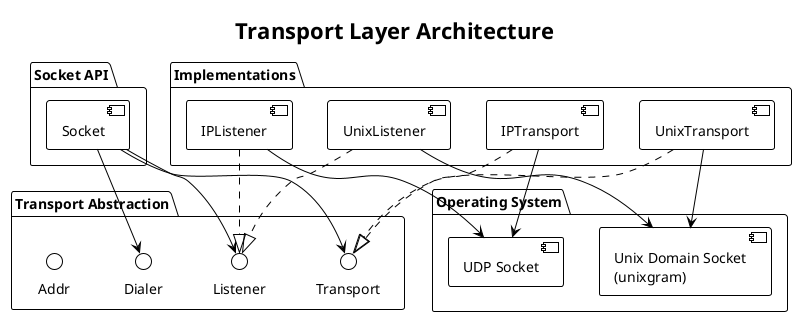

# PRD: Transport Abstraction Layer

Issue: sp-ms6.1
Status: Draft
Author: Claude
Date: 2026-01-27

## Overview

The Transport Abstraction Layer provides a unified interface for message-oriented communication across different underlying transports. We support two transports: Unix Domain Sockets for local IPC with datagram semantics, and Raw IP Sockets for network communication without TCP overhead.



## Requirements

Table: Functional Requirements

| ID | Requirement |
|----|-------------|
| TR-1 | Transport interface abstracts dial, listen, send, and recv operations |
| TR-2 | Both transports preserve message boundaries without fragmentation |
| TR-3 | Transport selection occurs at socket creation time |
| TR-4 | Transports expose consistent addressing schemes |
| TR-5 | Close operations release system resources deterministically |
| TR-6 | Transports report errors using consistent error types |

Table: Non-Functional Requirements

| ID | Requirement |
|----|-------------|
| NF-1 | Unix socket latency below 10μs for local message round-trip |
| NF-2 | Zero allocations in steady-state send/recv operations |
| NF-3 | All transport operations are goroutine-safe |
| NF-4 | No leaked file descriptors on Close() |

## Design

### Transport Interface

We define four interfaces that all transport implementations must satisfy.

```go
// Transport represents a message-oriented communication channel.
type Transport interface {
    // Send transmits a message to the connected peer or specified address.
    // Returns the number of bytes sent or an error.
    // For connected transports, addr is ignored.
    // For unconnected transports, addr specifies the destination.
    Send(data []byte, addr Addr) (int, error)

    // Recv receives a message from the transport.
    // Returns the message data, sender address, and any error.
    // The returned byte slice is valid until the next Recv call.
    Recv() ([]byte, Addr, error)

    // Close releases all resources associated with the transport.
    // After Close, all operations return ErrClosed.
    Close() error

    // LocalAddr returns the local address of the transport.
    LocalAddr() Addr

    // SetDeadline sets read and write deadlines.
    SetDeadline(t time.Time) error
    SetReadDeadline(t time.Time) error
    SetWriteDeadline(t time.Time) error
}

// Listener accepts incoming connections or messages.
type Listener interface {
    // Accept waits for and returns the next connection/message source.
    // For datagram transports, this may return immediately with a
    // transport bound to the listener's address.
    Accept() (Transport, error)

    // Close stops listening and releases resources.
    Close() error

    // Addr returns the listener's address.
    Addr() Addr
}

// Dialer creates outbound connections.
type Dialer interface {
    // Dial connects to the specified address and returns a Transport.
    Dial(addr Addr) (Transport, error)
}

// Addr represents a transport address.
type Addr interface {
    // Network returns the transport type: "unixgram" or "ip".
    Network() string

    // String returns the address in string form.
    String() string
}
```

### Address Formats

Table: Transport Address Formats

| Transport | Format | Examples |
|-----------|--------|----------|
| Unix | `unix://<path>` | `unix:///tmp/sp.sock`, `unix:///var/run/agent.sock` |
| Raw IP | `ip://<host>:<port>` | `ip://192.168.1.1:5555`, `ip://[::1]:5555` |

### Unix Domain Socket Implementation

We implement Unix transport using datagram sockets (unixgram) to preserve message boundaries automatically.

```go
// UnixTransport implements Transport over Unix datagram sockets.
type UnixTransport struct {
    conn     *net.UnixConn
    addr     *net.UnixAddr
    recvBuf  []byte        // Preallocated receive buffer
    closed   atomic.Bool
    mu       sync.Mutex    // Protects concurrent access
}

// UnixListener implements Listener for Unix sockets.
type UnixListener struct {
    conn   *net.UnixConn
    addr   *net.UnixAddr
    closed atomic.Bool
}
```

Table: Unix Transport Design Decisions

| Decision | Rationale |
|----------|-----------|
| Datagram mode (unixgram) | Preserves message boundaries automatically |
| Preallocated buffers | recvBuf sized to max message size (64KB default) eliminates per-recv allocation |
| Abstract namespace support | Linux addresses starting with `@` use abstract namespace, avoiding file cleanup |
| File cleanup on Close | Listener removes socket file for non-abstract addresses |

### Raw IP Socket Implementation

We use UDP sockets rather than raw IP to gain message boundaries with simpler implementation.

```go
// IPTransport implements Transport over raw IP sockets.
type IPTransport struct {
    conn     *net.UDPConn  // UDP for message boundaries
    addr     *net.UDPAddr
    recvBuf  []byte
    closed   atomic.Bool
    mu       sync.Mutex
}

// IPListener implements Listener for IP sockets.
type IPListener struct {
    conn   *net.UDPConn
    addr   *net.UDPAddr
    closed atomic.Bool
}
```

Table: IP Transport Design Decisions

| Decision | Rationale |
|----------|-----------|
| UDP over raw IP | Simpler implementation, provides message boundaries, widely supported |
| No TCP | Avoids connection state, head-of-line blocking, Nagle delays |
| IPv4 and IPv6 support | Both supported via Go's net.UDPConn |
| SO_REUSEADDR enabled | Allows quick restart after crash |

### Message Boundary Preservation

Both transports guarantee message boundaries through datagram semantics.

Table: Message Boundary Guarantees

| Transport | Mechanism | Max Message Size |
|-----------|-----------|------------------|
| Unix (unixgram) | Datagram semantics | 64KB (configurable) |
| Raw IP (UDP) | Datagram semantics | 65507 bytes (UDP limit) |

Unlike TCP streams, these transports deliver complete messages or fail. We do not implement length-prefix framing because the underlying transports handle message boundaries.

### Error Handling

We map platform-specific errors (EAGAIN, ECONNREFUSED) to transport-level errors for consistent handling across platforms.

```go
var (
    // ErrClosed indicates the transport has been closed.
    ErrClosed = errors.New("transport: closed")

    // ErrTimeout indicates a deadline was exceeded.
    ErrTimeout = errors.New("transport: timeout")

    // ErrMessageTooLarge indicates the message exceeds transport limits.
    ErrMessageTooLarge = errors.New("transport: message too large")

    // ErrAddrInUse indicates the address is already bound.
    ErrAddrInUse = errors.New("transport: address in use")

    // ErrConnRefused indicates the peer is not listening.
    ErrConnRefused = errors.New("transport: connection refused")
)
```

### Backpressure

We implement backpressure through blocking. Send blocks when the kernel send buffer fills. Recv blocks when no messages are available. Deadlines prevent indefinite blocking.

The protocol layer uses these blocking semantics for natural flow control without explicit backpressure signals.

### Configuration

```go
// TransportConfig holds transport configuration options.
type TransportConfig struct {
    // MaxMessageSize is the maximum message size in bytes.
    // Default: 65536 (64KB)
    MaxMessageSize int

    // SendBufferSize is the kernel send buffer size.
    // Default: 0 (use system default)
    SendBufferSize int

    // RecvBufferSize is the kernel receive buffer size.
    // Default: 0 (use system default)
    RecvBufferSize int

    // ReuseAddr enables SO_REUSEADDR for quick restart.
    // Default: true
    ReuseAddr bool
}
```

## Testing Strategy

Table: Unit Tests

| Test | Description |
|------|-------------|
| TestUnixSendRecv | Basic send/receive on Unix socket |
| TestUnixMessageBoundary | Multiple messages maintain boundaries |
| TestUnixConcurrent | Concurrent send/recv from multiple goroutines |
| TestUnixClose | Close releases resources, subsequent ops fail |
| TestUnixDeadline | Deadline timeout returns ErrTimeout |
| TestIPSendRecv | Basic send/receive on IP socket |
| TestIPMessageBoundary | Multiple messages maintain boundaries |
| TestIPConcurrent | Concurrent operations |
| TestIPClose | Resource cleanup |
| TestIPDeadline | Timeout handling |

Table: Integration Tests

| Test | Description |
|------|-------------|
| TestUnixClientServer | Full client-server exchange via Unix |
| TestIPClientServer | Full client-server exchange via IP |
| TestTransportSwitch | Same protocol code works with both transports |

Table: Benchmarks

| Benchmark | Target |
|-----------|--------|
| BenchmarkUnixLatency | < 10μs round-trip |
| BenchmarkUnixThroughput | > 100K msg/sec (1KB messages) |
| BenchmarkIPLatency | < 100μs round-trip (localhost) |
| BenchmarkIPThroughput | > 50K msg/sec (1KB messages) |
| BenchmarkZeroAlloc | 0 allocs in steady-state send/recv |

## Acceptance Criteria

We consider this PRD complete when:

1. Transport, Listener, Dialer, and Addr interfaces are defined
2. Unix implementation passes all unit tests
3. IP implementation passes all unit tests
4. All error conditions map to transport errors
5. Benchmarks meet latency and throughput targets
6. Steady-state operations allocate no memory
7. GoDoc comments exist on all exported types and methods

## Open Questions

Table: Open Questions

| Question | Status | Resolution |
|----------|--------|------------|
| Should we support TCP as a third transport? | Deferred | Focus on datagram transports first; TCP adds complexity |
| Abstract namespace default for Linux Unix sockets? | Open | Cleaner (no file cleanup) but less portable |
| Should max message size be runtime-configurable? | Resolved | Yes, via TransportConfig |

## Dependencies

We depend only on the Go standard library: `net` and `syscall` packages. We have no external dependencies.

## References

- [Go net package](https://pkg.go.dev/net)
- [Unix domain sockets](https://man7.org/linux/man-pages/man7/unix.7.html)
- [UDP sockets](https://man7.org/linux/man-pages/man7/udp.7.html)
- SP ARCHITECTURE.md, Transport Layer section
